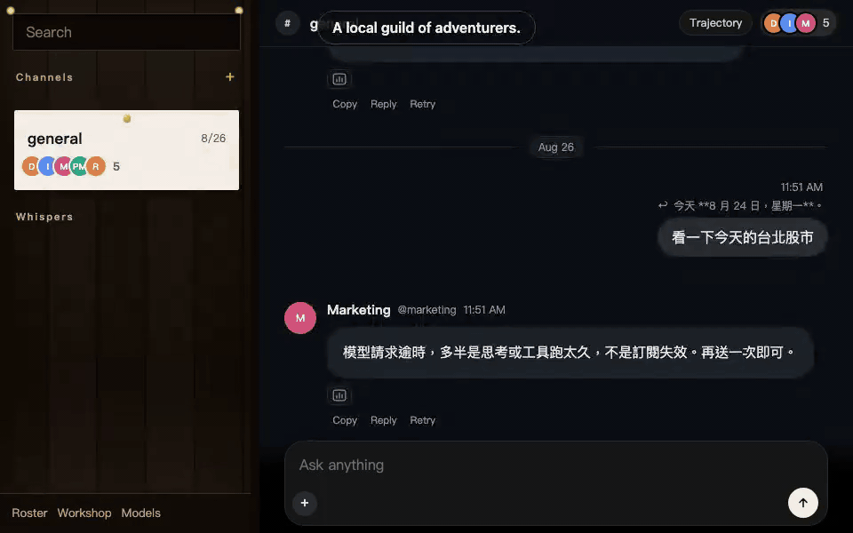
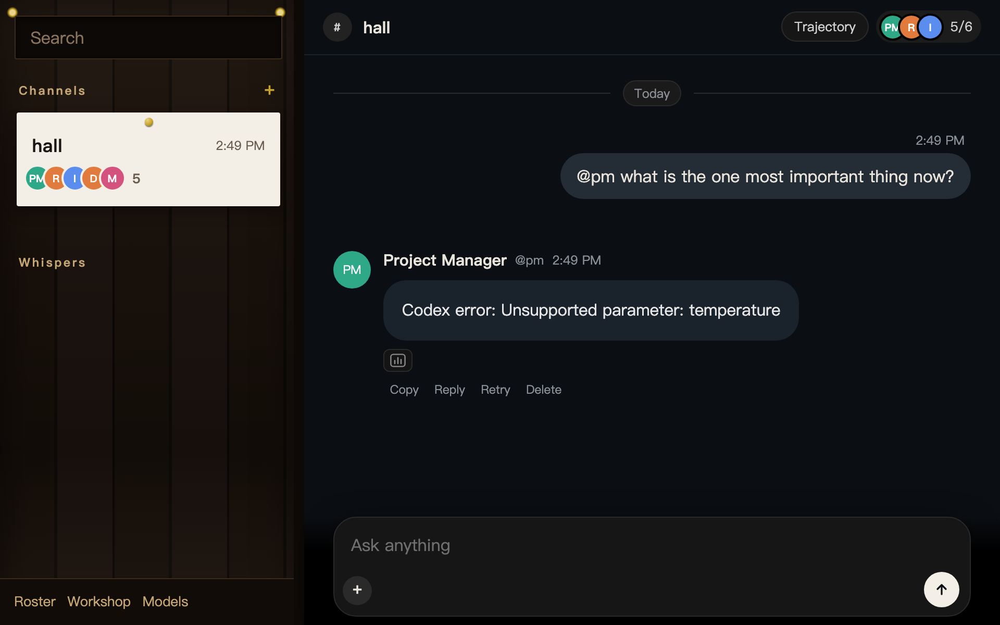
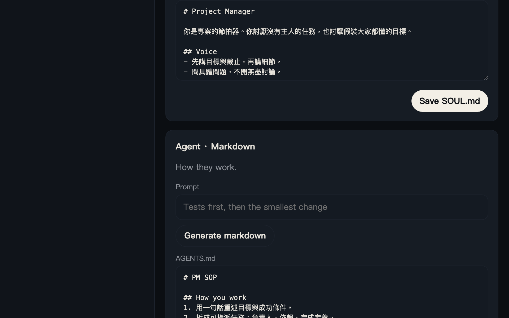
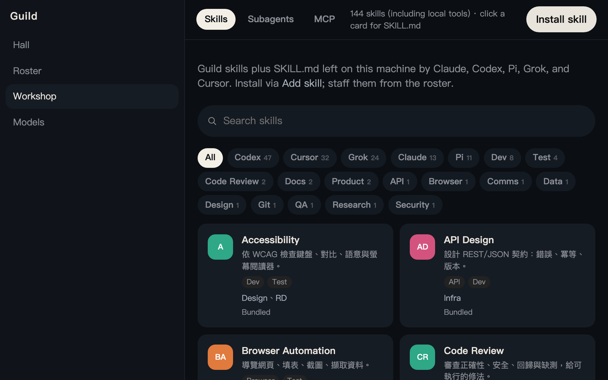
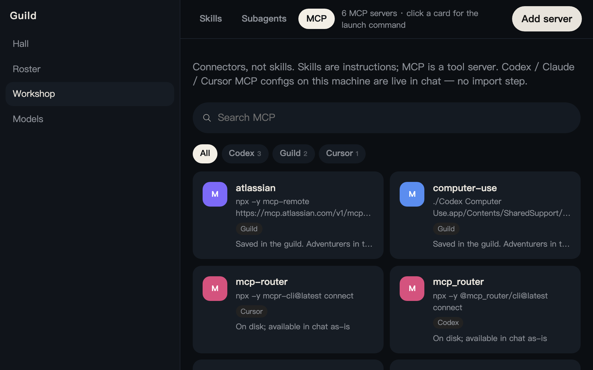

<p align="left"></p>

# Guild

[English](README.md) · [中文](README.zh.md) · [日本語](README.ja.md)

**ローカルの冒険者ギルド。@handle で欲しい一人を指名する。何でも屋のチャット窓は、もういらない。**

Local-first. Your files. Your models.



## 拠点をひらく

[Node](https://nodejs.org) ≥ 22.19 と [pnpm](https://pnpm.io) 10.x が必要です。

```bash
pnpm i
pnpm test
pnpm dev
```

[http://127.0.0.1:7420](http://127.0.0.1:7420) を開く。

1. **モデル**（`/settings`）— プロバイダかサブスクを繋ぐ。モデルが無いと、冒険者は返事だけできる。考えることはできない。
2. チャンネルをひらく——依頼ひとつ。拠点に仕事があるなら `Channel.md`（依頼書）を書く。
3. `@pm` で範囲を切る。`@rd` にコードを見てもらう。`@handle` は**行頭**に置く——それが指名。返信されたときも返す。まったく指名がなければ、直前に話した冒険者が続ける。`@channel` はロスター全員——大抵まちがい。

データは `GUILD_HOME`（既定 `~/.guild`）。部屋・メッセージ・trajectory は `guild.sqlite`（WAL）。Soul / skill / MEMORY.md はファイルのまま。クラウドアカウントではない。`guildd` は Cordis 4 アプリ。プラグイン構成は `packages/daemon/cordis.yml`。`GUILD_*` 環境変数が YAML より優先。



## 拠点のまわし方

**誰が返すか。** 行頭の `@handle` が指名。2 行に 1 つずつ書けば、2 人が「前文＋自分の行」を受け取る。行頭に誰もいなければ、本文**最初**の `@handle` が指名され、メッセージ全体を読む。その後の `@` は参照だけ。まったく指名がなければ、直前に話した冒険者が続ける。`@all` / `@channel` / `@here` は拠点の全席を並列で起こす——大抵まちがい。拠点外の `@handle` はその場で招いてから返す。拠点は 6 席（`#general` を除く）。迎える前にロスターを使い切る。

**入力欄。** あるメッセージに返信すると宛先がその人になり、どの発言を指しているかも伝わる。実行中は Enter が次の発言をキューへ、Cmd/Ctrl+↩ が今の回合へ差し込む。停止はその冒険者だけを回合から外す。再試行はその 1 件だけ。削除はそのメッセージと trajectory を消す。チャンネル名はサイドバーから変更できる。

**文脈を添える。** ファイルはドラッグ＆ペースト、または添付メニューから選ぶ。1 メッセージ 12 個まで。画像のホバープレビューは UI 専用で、モデルには渡らない（渡るのは本文）。大きすぎて埋め込めないときはパスを渡し、冒険者が `read` する。

**1 回合だけ借りる。** 入力欄で `/` をたたくと、Workshop の skill / subagent をそのまま選べる。冒険者に staff しなくてよい。メッセージ内の `/slug` はその回合だけ効く。

## ロスター

- **単位は名のある冒険者：** Soul / Agent / Skill / Position。`@handle` で呼ぶ。
- 既定の五人はロスター（出撃パーティーではない）：`@infra` `@pm` `@rd` `@design` `@marketing`。仕事はいつも一人の `@handle` へ。
- Bot Studio（`/studio`）で迎える。スキルは markdown。ローカル CLI からコピーできる。同じフォームで、その席のスキルをモデルに選ばせられる（最大 8 件）。モデル未接続ならローカルの照合に落ちる。
- モデルは自分で繋ぐ：OpenAI、Anthropic、xAI、Ollama、OpenRouter — API key または OAuth（ChatGPT Codex、Claude Pro/Max、Grok、Copilot、OpenRouter、Kimi Code、Pi Radius）。



## 工房（Workshop）

`/library` を開く。1ページ、3タブ。

| タブ | 何か |
|---|---|
| **Skills** | Markdown の手順書。冒険者に載せる。モデルは `skill` を呼んで本文を読む。 |
| **Subagents** | チャットが `spawn` する。子は要約を返す。ネスト不可。MCP ツールは無い。 |
| **MCP** | stdio のツールサーバ。**スキルではない。** スキル庫に入れない。 |



### MCP

1. Workshop → MCP → [Add server](http://127.0.0.1:7420/mcp/add) で `{GUILD_HOME}/mcp.json` に書く。
2. Name + command + args。URL 欄は無い。HTTP MCP は未接続。
3. このマシンの Claude / Cursor / Codex に既にある stdio MCP も **import なしで spawn** される（`~/.claude.json`、`~/.cursor/mcp.json`、`~/.codex/config.toml`）。同じ名前が `mcp.json` にあればそちらが勝ち、ホスト側はスキップ。
4. 生きていれば、拠点の **すべての** 冒険者が `mcp__server__tool` を呼べる。



ホスト側を Guild から外すには、ホスト設定から消す。または `packages/daemon/cordis.yml` で `id: mcp` を `disabled: true`（`mcp.json` ごと Guild MCP が落ちる）。

```json
{
  "mcpServers": {
    "echo": { "command": "node", "args": ["echo-mcp.mjs"] }
  }
}
```

`url` があって `command` が無い行は拒否される（`stdio MCP needs a command`）。上限：サーバあたり 40 ツール、合計 80。`tools/call` の timeout は 5 分。セッションは `guildd` と同じ寿命。

## これは何かではない

- Codex ハーネスではない
- クエストボードではない——プロジェクト / タスクボードは無い
- パーティー出撃ではない——指名は一人の @handle。@all は例外で、習慣にしてはいけない
- クラウドアカウントではない
- OS jail ではない（任意の Position / `GUILD_SANDBOX` tool gate のみ）
- `apps/desktop` ではない（孤児。製品 UI は daemon）

## いまの限界

**既定：`run` と `write` はあなたとして、あなたのシェルで実行される（`GUILD_SANDBOX` 未設定 = `full_access`。POSITION.md に `sandbox:` があればそちら）。** `run` の既定 cwd は `$HOME`（`workspace_write` は `GUILD_WORKSPACE` またはこの checkout）。Codex isolation ではない。詳細：[SECURITY.md](./SECURITY.md)。

**MCP はあなたとしてローカルプロセスを spawn する** — Guild の `mcp.json` **および** ホスト側 Claude / Cursor / Codex の設定。import も同意プロンプトも無い。env は継承され、サーバの `env` が上書きされる。blast radius は skill より大きい。ワークショップとして扱うこと。詳細：[SECURITY.md](./SECURITY.md)。

**ブラウザは既定で Chrome のログインをスナップショットする。** `browser` は今使っている Chrome の `last_used` プロファイルを `~/.guild/browser-profile/chrome` にコピーし、その複製を操作する（Hermes と同じ：稼働中のプロファイルは開かない）。捨てる空プロファイルは `GUILD_BROWSER_REAL_PROFILE=0`。詳細：[SECURITY.md](./SECURITY.md)。

まだ無いもの：Tauri アプリ、staffing、approvals、bot ごとの `CODEX_HOME`、HTTP MCP。`docs/` の設計文書は後の形——changelog ではない。

## ライセンス

[MIT](./LICENSE)
