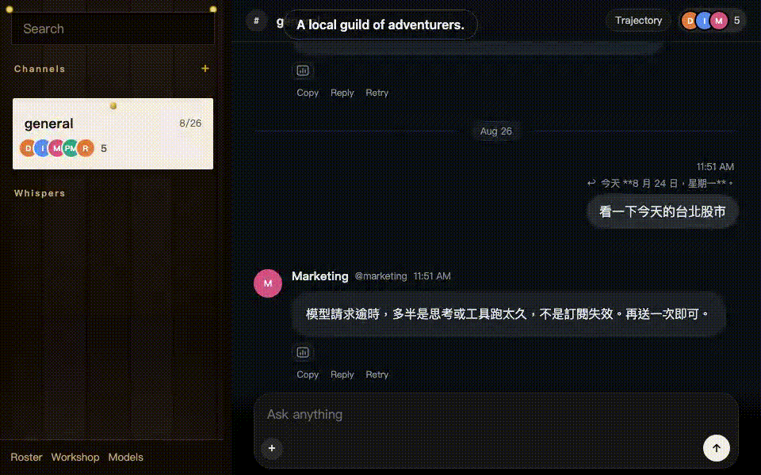

<p align="left"></p>

# Guild

[English](README.md) · [中文](README.zh.md) · [日本語](README.ja.md)

**ローカルの人材ベンチ。@handle で人を呼ぶ。何でも屋のチャット窓は、もういらない。**

Local-first. Your files. Your models.



## クイックスタート

[Node](https://nodejs.org) ≥ 22.19 と [pnpm](https://pnpm.io) 10.x が必要です。

```bash
pnpm i
pnpm test
pnpm dev
```

[http://127.0.0.1:7420](http://127.0.0.1:7420) を開く。

1. **モデル**（`/settings`）— プロバイダかサブスクを繋ぐ。モデルが無いと、bot は返事だけできる。考えることはできない。
2. チャンネルを開く。部屋に仕事があるなら `Channel.md` を書く。
3. `@pm` で範囲を切る。`@rd` にコードを見てもらう。@ されたとき（または返信したとき）だけ返す。`@channel` は全員に飛ぶ——大抵まちがい。

データは `GUILD_HOME`（既定 `~/.guild`）。クラウドアカウントではない。

## これは何か

- **単位は人：** Soul / Agent / Skill / Position。`@handle` で呼ぶ。
- 既定の五席：`@infra` `@pm` `@rd` `@design` `@marketing`。
- Bot Studio（`/studio`）で雇う。スキルは markdown。ローカル CLI からコピーできる。
- モデルは自分で繋ぐ：OpenAI、Anthropic、xAI、Ollama、OpenRouter — API key または OAuth（ChatGPT Codex、Claude Pro/Max、Grok、Copilot、OpenRouter）。

## 工房（Workshop）

`/library` を開く。1ページ、3タブ。

| タブ | 何か |
|---|---|
| **Skills** | Markdown の手順書。bot に載せる。モデルは `skill` を呼んで本文を読む。 |
| **Subagents** | チャットが `spawn` する。子は要約を返す。ネスト不可。MCP ツールは無い。 |
| **MCP** | stdio のツールサーバ。**スキルではない。** スキル庫に入れない。 |

### MCP

1. Workshop → MCP → [Add server](http://127.0.0.1:7420/mcp/add)。またはこのマシンの Codex / Claude / Cursor のカードを import。
2. Name + command + args。URL 欄は無い。HTTP MCP は未接続。
3. 接続後、チャンネルの **すべての** bot がそれらのツールを呼べる。名前は `mcp__server__tool`。

設定は `{GUILD_HOME}/mcp.json`（既定 `~/.guild/mcp.json`）。ホスト側のファイル（`~/.claude.json`、`~/.cursor/mcp.json`、`~/.codex/config.toml`）は一覧だけ。**Guild に import してから**チャットで使える。import は起動設定をコピーする。ホストファイルを直接は読まない。

```json
{
  "mcpServers": {
    "echo": { "command": "node", "args": ["echo-mcp.mjs"] }
  }
}
```

`url` があって `command` が無い行は拒否される（`stdio MCP needs a command`）。上限：サーバあたり 40 ツール、合計 80。`tools/call` の timeout は 5 分。セッションは `guildd` と同じ寿命。

## これは何かではない

- Codex ハーネスではない
- プロジェクト / タスクボードではない
- クラウドアカウントではない
- ツールはサンドボックスされていない
- `apps/desktop` ではない（孤児。製品 UI は daemon）

## いまの限界

**`run` と `write` はあなたとして、あなたのシェルで、サンドボックスなしで実行される。** `run` の既定 cwd は `$HOME`。`write` はプロセスが書ける任意のパスに書ける。破壊的なコマンドはいくつか拒否される。それは防護ではない。

**MCP はあなたとしてローカルプロセスを spawn する。** env は継承され、サーバの `env` が上書きされる。blast radius は skill より大きい。ワークショップとして扱うこと。詳細：[SECURITY.md](./SECURITY.md)。

まだ無いもの：Tauri アプリ、SQLite、staffing、approvals、bot ごとの `CODEX_HOME`、HTTP MCP。`docs/` の設計文書は後の形——changelog ではない。

## ライセンス

[MIT](./LICENSE)
