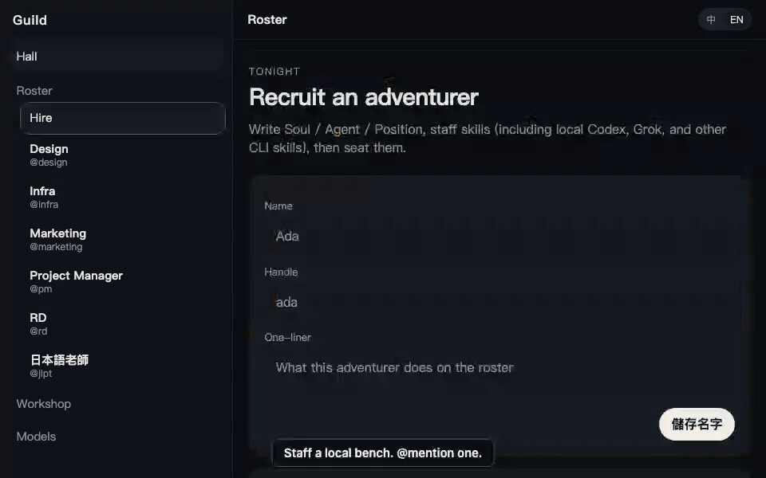

<p align="left"></p>

# Guild

[English](README.md) · [中文](README.zh.md) · [日本語](README.ja.md)

**本機冒險者工會。用 @handle 點名你要的那個人，不要再開一個什麼都會的聊天窗。**

Local-first. Your files. Your models.



## 打開大廳

需要 [Node](https://nodejs.org) ≥ 22.19 與 [pnpm](https://pnpm.io) 10.x。

```bash
pnpm i
pnpm test
pnpm dev
```

打開 [http://127.0.0.1:7420](http://127.0.0.1:7420)。

不 clone —— 只要 Node ≥ 22.19：

```bash
npx @kevin5251984/guild web
```

靜態預覽（無模型、無工具）：[jakevin.github.io/guild](https://jakevin.github.io/guild/)。

1. **模型**（`/settings`）— **第一件事。** 連接訂閱（OAuth）或貼上 API key，再套用主模型。沒有可用模型，Guild 不能想、也不能跑工具。先不要 `@mention`。
2. 開一個頻道——一張委託。大廳有活就寫 `Channel.md`（委託書）。
3. `@pm` 收範圍，`@rd` 看程式。`@handle` 要放在**行首**——那才是分派。你回他們時他們也會接；完全沒點名，就由上一個說話的冒險者繼續。`@channel` 會叫整支編制——通常是錯的。

資料在 `GUILD_HOME`（預設 `~/.guild`）。房間、訊息、軌跡在 `guild.sqlite`（WAL）；Soul / skill / MEMORY.md 仍是檔案。不是雲端帳號。`guildd` 是 Cordis 4 應用；插件組合在 `packages/daemon/cordis.yml`。`GUILD_*` 環境變數仍蓋過 YAML。


## 據點怎麼運轉

**誰會回。** 行首的 `@handle` 才是分派。兩行各一個 `@handle`，就是兩個人各自領一份：你的前言，加上他那一行。行首沒人時，內文**第一個** `@handle` 就是被指派的人，並拿到整段訊息；再往後的 `@` 只是提到。完全沒點名，就由上一個說話的冒險者接。`@all` / `@channel` / `@here` 會把據點每一席同時叫醒——通常是錯的。`@` 一個不在據點的人，會先把人拉進來再回。一個據點 6 席（`#general` 除外）：先重用編制，再招人。

**輸入框。** 回覆某一則訊息，就是指定那個人，也讓他看到你指的是哪一句。有人在跑的時候，Enter 排隊，Cmd/Ctrl+↩ 插入這輪。停止把那一名冒險者從這輪拉下來。重問只重問那一題。刪除拿掉那一則訊息與它的軌跡。頻道可在側欄改名。

**帶上下文。** 檔案拖進輸入框、貼上，或從附件選單挑，一則訊息最多 12 個附件。圖片的懸停預覽只在介面看得到；模型收到的是文字本文。太大嵌不進去時，Guild 改送路徑，讓冒險者自己 `read`。

**只借一招。** 輸入框打 `/`，直接挑工坊的技能或子代理，不必先掛到誰身上。訊息裡的 `/slug` 只在這一回合生效。

## 編制

- **單位是有名字的冒險者：** Soul / Agent / Skill / Position，用 `@handle` 叫。
- 預設小隊五席——是編制，不是出征：`@infra` `@pm` `@rd` `@design` `@marketing`。出活仍點名一人。
- 在 Bot Studio（`/studio`）招人。技能是 markdown；可從本機 CLI 拷進來。同一張表單也能叫模型替這席挑技能，上限 8 項；沒接模型時退回本機比對。
- 模型自己接：OpenAI、Anthropic、xAI、Ollama、OpenRouter — API key 或 OAuth（ChatGPT Codex、Claude Pro/Max、Grok、Copilot、OpenRouter、Kimi Code、Pi Radius）。


## 工坊

打開 `/library`。一頁三個 tab。

| Tab | 是什麼 |
|---|---|
| **技能** | Markdown 說明書。掛到冒險者身上。模型要 call `skill` 才會載入正文。 |
| **子代理** | 對話裡 call `spawn`。子代理回一份摘要。不能再套一層。沒有 MCP 工具。 |
| **MCP** | stdio 工具伺服器，**不是技能**。不要放進技能庫。 |


### MCP

1. 工坊 → MCP → [連接伺服器](http://127.0.0.1:7420/mcp/add) 寫進 `{GUILD_HOME}/mcp.json`。
2. Name + command + args。沒有 URL 欄。HTTP MCP 沒接。
3. 這台機器上 Claude / Cursor / Codex 已配的 stdio MCP **免匯入、直接 spawn**（`~/.claude.json`、`~/.cursor/mcp.json`、`~/.codex/config.toml`）。`mcp.json` 裡同名的列贏，host 那份略過。
4. 活著之後，據點裡**每個**冒險者都能 call 這些工具。名字長得像 `mcp__server__tool`。


不要讓某個 host server 進 Guild：從 host 設定拿掉，或把 `packages/daemon/cordis.yml` 的 `id: mcp` 設成 `disabled: true`（Guild MCP 整包關掉，含 `mcp.json`）。

```json
{
  "mcpServers": {
    "echo": { "command": "node", "args": ["echo-mcp.mjs"] }
  }
}
```

有 `url` 沒有 `command` 會被拒（`stdio MCP needs a command`）。上限：每個 server 40 個工具，合計 80。`tools/call` timeout 5 分鐘。Session 跟 `guildd` 活一樣久。

## Harness 是怎麼跑的

一回合、一條 process：`@handle` → `chatReply` → `HarnessService.turn` → `runAgentLoop`。

**組裝。** `buildChatSystem`（`generate.ts`）依序疊：你是誰（`@handle`）、據點規則、本機環境、工具清單、這一回合的技能／子代理目錄、`Channel.md`、`MEMORY.md`，最後才是 `SOUL.md` / `AGENTS.md` / `POSITION.md`。目錄只有名字和摘要；技能正文要模型自己 call `skill` 才載入。`Channel.md` 蓋過 `MEMORY.md`。歷史會在送到模型之前先壓縮。

**迴圈。** `runAgentLoop`（`harness.ts`）帶著工具目錄去問模型。沒有要工具，那句話就是回覆。要工具，就 `Promise.all` 平行跑完，把每個結果塞回訊息清單，再問一次。迴圈有上限；碰到上限就改要最終回覆，不再給工具。

**你還在迴圈裡。** 有人在跑的時候回覆，是排隊；Cmd/Ctrl+↩ 把這句插入當前回合，下一輪以 `<user_steer>` 送到模型。停止 abort 這一回合的 `AbortSignal`——provider 的 fetch 和 `spawn` 子代理拿的是同一個 signal。只有 Stop 會提前結束一回合。沒有審批步驟，也不會先問你。

**閘門。** 工具跑之前，`gateTool`（`harness.ts`）先看這席的 sandbox：`full_access`（預設）全放；`read_only` 只留 `read` / `list` / `skill` / `spawn`；`workspace_write` 把 `write` / `run` 鎖在 workspace，MCP 和 `image_gen` 直接拒。這是單一 process 裡、跑在你權限下的 tool gate；它擋不掉什麼，`Current limits` 那段寫得很直。

**為什麼在這裡提 Hermes。** 我們借的是一個形，不是 codebase。Hermes 是最接近的公開範例：本機 agent 能用你的瀏覽器，又不動你正在跑的 Chrome。`browser.ts` 借的就是這個做法——不 CDP live profile（Chrome 136+），把 `last_used` 快照到 `~/.guild/browser-profile/chrome`，操作那份複本。借到這裡為止。回合迴圈是 Guild 自己的（`runAgentLoop` + `gateTool`）；sandbox 名稱是 Codex 形狀，但這不是 Codex app-server 的 harness；`docs/` 裡那個 `Harness` trait 也沒實作。

檔案：`packages/daemon/src/harness.ts`（迴圈、閘門、policy）· `generate.ts`（system 組裝、`HALL_RULES`）· `tools.ts`（目錄、steer、回合上限）· `browser.ts`（profile 快照）。

## 它不是什麼

- 不是 Codex harness
- 不是任務板——頻道是一張沒結案的委託
- 不是小隊出征——點名一個 @handle；@all 是例外，不是習慣
- 不是雲端帳號
- 不是 OS jail（可選 Position / `GUILD_SANDBOX` tool gate）
- 不是 `apps/desktop`（孤兒；產品 UI 是 daemon）

## 現況限制

**預設：`run` 與 `write` 以你的身分、在你的 shell 執行（`GUILD_SANDBOX` 未設 = `full_access`，除非該 bot 的 POSITION.md 有 `sandbox:`）。** `run` 的預設 cwd 是 `$HOME`（`workspace_write` 用 `GUILD_WORKSPACE` 或本 checkout）。這是 tool gate，不是 Codex isolation。細節：[SECURITY.md](./SECURITY.md)。

**MCP 會以你的身分 spawn 本機 process** — Guild 的 `mcp.json` **以及** 本機 Claude / Cursor / Codex 設定，沒有匯入、沒有同意步驟。env 會繼承，再疊上該 server 的 `env`。殺傷半徑比 skill 大。把這當工作坊。細節：[SECURITY.md](./SECURITY.md)。

**瀏覽器預設帶你的 Chrome 登入。** `browser` 把你**正在用的** Chrome profile（`last_used`）快照到 `~/.guild/browser-profile/chrome` 再操作那份複本（對齊 Hermes：不開你正在跑的那個）。設 `GUILD_BROWSER_REAL_PROFILE=0` 才用拋棄式空 profile。細節：[SECURITY.md](./SECURITY.md)。

也還沒做：Tauri app、staffing、approvals、每 bot 一份 `CODEX_HOME`、HTTP MCP。`docs/` 裡的設計文件是之後的形狀——不是 changelog。

## 授權

[MIT](./LICENSE)
