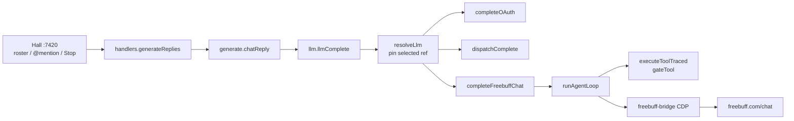

# Freebuff Chat 網頁橋接（guildd）

| Field | Value |
|---|---|
| Title | Freebuff Chat web bridge for Guild |
| Author | Guild maintainers |
| Date | 2026-09-04 |
| Status | Shipped (rev 5) — SDK transport; browser-only v1 sections kept as history |
| Product | Guild（`bot-cordis` / `guildd` / `@guild/*`） |
| Audience | 實作這條 generate 路徑的 senior engineer |
| Related | [`packages/daemon/src/llm.ts`](packages/daemon/src/llm.ts), [`generate.ts`](packages/daemon/src/generate.ts), [`harness.ts`](packages/daemon/src/harness.ts), [`oauth.ts`](packages/daemon/src/oauth.ts), [`browser.ts`](packages/daemon/src/browser.ts), [`opencode-free.ts`](packages/daemon/src/opencode-free.ts), [miuuyy/codex-chatgpt-web](https://github.com/miuuyy/codex-chatgpt-web), [CodebuffAI/freebuff](https://github.com/CodebuffAI/freebuff) |

---

## Shipped transport (rev 5): `@codebuff/sdk`，不是瀏覽器

> **Rev 5（上版修訂，2026-09-05）：** 本文件 v1 草擬的 **browser-only transport 已被取代（superseded）**。實際上線走 `@codebuff/sdk` 的 `CodebuffClient`。下文所有 embedded-browser 章節（### 6 獨立 Chromium profile、### 8 Selector pack、### 9 廣告／waiting room／session cap）**保留為歷史脈絡與決策紀錄，不再是實作規格**。paste mode A/B/C 的語意改為 SDK prompt 組裝（round 0 全量、round 1+ 增量貼回工具結果），不是剪貼簿。

實作對照：

| 面 | 實作 | 碼 |
|---|---|---|
| Client | `new CodebuffClient({ apiKey: <token>, cwd, maxAgentSteps: 20, agentDefinitions: [root], overrideTools })` | `freebuff-bridge.ts` `defaultCreateClient` / `runSdkPrompt` |
| Session admission | `getFreebuffSessionManager().ensure(token, providerModel, signal)` 對 `www.codebuff.com` 驗票；過期重驗、in-flight 去重 | `freebuff-session.ts` |
| 遠端工具禁用 | `overrideTools: denyFreebuffRemoteTools()`：`read_files` / `write_file` / `run_file_change_hooks` 一律回 `FREEBUFF_DENY_MESSAGE`；SDK cwd 釘 `{GUILD_HOME}/freebuff-scratch`（`0700`，空） | `freebuff-agent.ts`、`freebuff-bridge.ts` `ensureScratch` |
| 模型 | `costMode: "free"`；root agent `base3-free-deepseek-flash`（`deepseek/deepseek-v4-flash`）或 `base3-free-glm-5-3-flash`（`z-ai/glm-5.3-flash`） | `freebuff-agent.ts` `ROUTES` |
| Guild 工具 | 仍由 Guild 執行：system 內 `guild_tools` fence → `parseGuildToolsEnvelope` → `runAgentLoop` 本地執行 → 結果 mode C 貼回下一輪 | `freebuff-chat.ts`、`freebuff-bridge.ts` `runLockedTurn` |
| 佔用與排隊 | `acquireFreebuffMutex({ queue: true })`；`spawn` / `compression` / aux 不走此橋 | `freebuff-bridge.ts` |
| 串流 | `handleStreamChunk`：`reasoning_chunk` 進 thinking、其餘進 text；idle 逾時 `StreamIdleError` → fail-closed | `freebuff-bridge.ts` |
| Fail-closed | `freebuff_login_required` / `freebuff_busy` / `freebuff_stream_idle` / `freebuff_limited_mode` / `freebuff_tool_parse` / `freebuff_context_too_large`；**不** fallback 到其他 provider | `freebuff-bridge.ts` `mapRunError` |
| 憑證 | `resolveFreebuffAuth`：官方登入 `~/.config/manicode/credentials.json` 優先；無登入時 `CODEBUFF_API_KEY` 環境變數 fallback（`legacy-api-key`） | `freebuff-auth.ts` |

---

## Overview

Guild 是本機優先的 bot 工作台：大廳（roster、@mention、tools、Trajectory、Stop）是產品；模型只是 generate 路徑的後端。使用者要的不是 API key、不是把 Freebuff CLI 包成 Skill / SubAgent，也不是用 OpenCode Free（`opencode.ai/zen/v1`，provider id `opencode-free`）頂替——那條路不穩，而且不是這份設計存在的理由。

要的形狀對齊 [codex-chatgpt-web](https://github.com/miuuyy/codex-chatgpt-web)：產品 UI 與 harness 留在本機，本機橋接把「當前這一輪」送進對方的 **網頁產品**，再把可見輸出流回來。

```text
Codex task ──Responses + SSE──▶ local bridge ──embedded browser──▶ ChatGPT Web

Hall @handle ──guildd / generate.ts / llm.ts──▶ local bridge ──browser──▶ Freebuff Chat
```

Guild **不是** Codex app-server，也沒有 Responses daemon。橋接必須以 **provider / generate path** 掛進現有的 `resolveLlm` → `llmComplete` → `runAgentLoop`，而不是另起一臺 Codex 形狀的 loopback Responses 服務。v1 是 **browser-only**（text in, stream out）：工具仍由 Guild 執行（`guild_tools` fence，含 `image_gen`）；Freebuff 的網頁 agent 不得再對使用者 repo 開 shell。Chat 席走這座橋；`spawn` / `compression` / harvest / `generate` / aux **不得**占用同一 Chat tab。UI 漂移、登入過期、waiting room、廣告卡住、geo limited-mode、session cap、user Stop 一律 **fail-closed**，大廳顯示明確錯誤，**禁止**靜默落到 OpenCode Free 或其他 provider（chat 回合釘死 selected ref）。`packHistory` 必須用 composer 預算壓縮，不是 88k/400k 預設。

---

## Background & Motivation

### Guild 今天怎麼跑模型

| 層 | 實際檔案 | 行為 |
|---|---|---|
| 大廳 | `packages/daemon/src/public/chat.html`，`http://127.0.0.1:7420` | roster、@mention、Trajectory、Stop |
| 回合 | `handlers.ts` `generateReplies` → `store.beginTurn` / `armBotTurn` | 每席一個 `AbortSignal`；Stop 走 `abortTurn` |
| 系統提示 | `generate.ts` `buildChatSystem` | Hall rules、tools、Channel.md、MEMORY.md、Soul / Agent / Position |
| 壓縮 | `compact.ts` `packHistory` | 工作記憶；Channel.md 是任務，MEMORY.md 是 standing notes |
| 完成 | `llm.ts` `llmComplete` → `dispatchComplete` 或 `oauth.ts` `completeOAuth` | 訂閱走 pi-ai；其餘走 HTTP |
| 工具迴圈 | `harness.ts` `runAgentLoop`；`tools.ts` `MAX_TOOL_ROUNDS = 128` | 提供者只實作 `ask`；工具一律 `executeToolTraced` → `gateTool` |
| 中斷 | `tools.ts` `roundSignal` = `ctx.signal`；`oauth.ts` `STREAM_IDLE_TIMEOUT_MS = 300_000` | **沒有** 5 分鐘 wall-clock round abort。Idle = 串流上沒有 token，不是整輪牆鐘 |
| 模型檔 | `{GUILD_HOME}/models.json`（`0600`） | `DEFAULT_MODELS.default` 仍是 `opencode-free` / `muse-spark-1.2-contributor-free` |
| 訂閱 | `{GUILD_HOME}/oauth.json`（`0600`） | device / PKCE；settings `/settings/subs` |
| 瀏覽工具 | `browser.ts` | Hermes 形：快照 `last_used` Chrome 到 `{GUILD_HOME}/browser-profile/chrome/`，**不** CDP live profile |
| Schema | `db.ts` `SCHEMA_VERSION = "2"` | 只允許 additive；session cookie **不進** SQLite、不進 git |

`llm.ts` 的 picker 三種 kind：`keyless`（OpenCode Free）、`key`（openai / xai / anthropic / ollama / openrouter）、`oauth`（`SUBSCRIPTIONS`）。本橋加第四種 **`web-bridge`**（不要用 `"web"`：`AUX_ROLES` 已有 `id: "web"` = Web extract）。Hall `/settings` 是模型選擇器。不要重漆 enamel/steel，不要為了這條橋改寫 README 產品文案——除非某一句預設陳述會變成假的。預設仍然是 OpenCode Free；本橋是 **opt-in**。

現況裡與本橋相撞的路徑（必須在設計裡關掉，不能留給實作猜）：

| 呼叫 | 檔案 | 今天會發生什麼 |
|---|---|---|
| 一波多席 `Promise.all(targets.map(speak))` | `handlers.ts` `generateReplies` | 並行 `llmComplete` |
| `spawnSubagent` | `subagent.ts` ~358–381 | `role: "spawn"`、**同一個** `ctx.signal`、`tools: true` |
| `packHistory` → `summarizeOld` | `compact.ts` ~274–307 | `role: "compression"`、`prefer` = 聊天模型，發生在 `llmComplete` **之前** |
| harvest | `plugins/memory.ts` `guild/turn-complete` | `extractMemory` `role: "compression"`、`prefer: bot.model ?? null` |
| Studio generate | `generate.ts` `tryLlmGenerate` | `role: "generate"` |
| Hall Stop | `handlers.ts` `isAbortError` | 只在 `err.name === "AbortError"` **逃出** `llmComplete` 時吞掉；OAuth `catch` + `formatOAuthError` 會把 `"aborted"` 寫成「模型請求逾時…不是訂閱失效」 |
| `publicModels.active.ready` | `llm.ts` ~341–347 | `resolveLlm` 有 target 就 `true` |
| CDP `sendCdp` | `browser.ts` ~384–390 | **25s** 逾時；`freePort()` **未 export** |

### 為什麼需要橋，而不是「再用一次 HTTP」

[Freebuff](https://github.com/CodebuffAI/freebuff) 有五個產品：Desktop、CLI、Web（`freebuff.com/web` 全端 app builder）、Cloud、Chat（`freebuff.com/chat` 研究對話）。內建模型（廣告贊助、geo / session 限制）：DeepSeek V4 Flash 07/31、GLM 5.3 Flash、GPT-5.6 Luna、MiMo 2.5、Solar Pro 4。**沒有**給第三方的官方 OpenAI-compatible public root URL。

CLI（`npm i -g freebuff`）是互動 TUI。Freebuff 品牌在 `cli/src/cli-args.ts` 寫明 *"simplified CLI - no prompt args"*：`run freebuff "task"` **不是** print / headless 路徑。Guild 的 `run` 是 `execFile($SHELL, ["-lc", command])`，沒有 waiting room、廣告、登入瀏覽器，也不是真 TTY。Desktop 可以掛本機 Claude Code / Codex 帳號——那是使用者自己的帳號，不是 Guild 的 `models.json`。

社群 reverse proxy（freebuff2api 等）存在：非官方、刮 token / 廣告、ToS 風險。這份設計不把它當成官方路徑。

### 為什麼不能 fork codex-chatgpt-web

[codex-chatgpt-web](https://github.com/miuuyy/codex-chatgpt-web) 是 **ChatGPT DOM + Codex Responses** 專用啟動器：loopback Responses daemon、Electron 內嵌瀏覽器、ChatGPT Temporary Chat、Full mode 還要 outbound `openai/tunnel-client` + ChatGPT MCP connector（`Codex Native2`）。Guild 倉庫裡 **沒有** Codex app-server、沒有 Tauri 產品殼、沒有 task board。把 Freebuff 丟進那個啟動器不可行；把 Guild 改成 Codex 客戶端也不在範圍。

借的是 **形**，不是 codebase：

| 借 | 不借 |
|---|---|
| 產品 UI + harness 留在本機 | Responses daemon、`openai_base_url` 劫持 |
| browser-only 先做 | Electron launcher、tunnel-client、ChatGPT connector |
| fail-closed（UI drift 明確失敗） | ChatGPT selector、Temporary Chat 語意 |
| loopback only、profile 在 home 下 | Codex compaction MCP checkpoint |
| 工具留在本機 harness | 讓遠端網頁再開一層 agent 去 shell repo |

### 痛點

1. 使用者想用 Freebuff **網頁產品裡的模型**，不是 Zen keyless、不是 BYOK、不是 CLI TUI。
2. 現有 `resolveLlm` 在 `tryProvider` 失敗時會落到 `file.default`、再掃 `file.providers`、再 `envFallback`。若使用者選了尚未就緒的訂閱，今天可能靜默用上 OpenCode Free。這條橋 **禁止** 那種行為。
3. `llmComplete` 對非 OAuth 路徑 `catch { return null }`，`chatReply` 再落到 `localChatReply`（「沒有可用模型」）。橋接錯誤必須是 **llm 來源的明確失敗文案**，不能變成假的本機回覆，也不能換成別家模型。

---

## Goals & Non-Goals

### Goals

1. 在 Hall `/settings` 以 picker kind **`web-bridge`**、id `freebuff-chat` 出現 **Freebuff Chat**，可連接、可選模型、可套用為主模型或某席 `Bot.model`。
2. `@handle` 回合：`tryChatLlm` 先 `resolveLlm`、換成 fence-only system、以 **Guild 預設 88k** `packHistory`（寫 checkpoint）。Paste mode **只在 mutex 拿到之後**才決定。Mode A 再把該 payload 壓到 32k（不寫新 checkpoint）；Mode B 只貼新 user（+ MEMORY delta）。橋用獨立 Chromium 操作 `https://freebuff.com/chat`。
3. 工具仍是 Guild 的 `run` / `read` / `write` / `list` / `skill` / `spawn` / `read_spawn` / `browser` / `cronjob` / `image_gen` / MCP。`runAgentLoop` 不變。此 transport **替換** `TOOL_SYSTEM` 為 fence-only 契約。Freebuff 網頁不得成為第二個會改 repo 的 agent。
4. 中斷語意複製 Pi / Codex / Hermes：`roundSignal` 只有 user Stop；串流 idle 用 `STREAM_IDLE_TIMEOUT_MS`（300s，無 token 才算）；`MAX_TOOL_ROUNDS = 128`（最後一輪 `TOOL_LOOP_WRAP`）。**不**恢復 5 分鐘 LLM wall-clock round abort。Stop 必須讓 `AbortError` 逃出 `llmComplete`（不得經 `formatOAuthError`）。
5. Fail-closed：登入過期、UI drift、waiting room、廣告擋 composer、limited-mode 沒有該模型、session cap、Chrome 找不到、視窗被關——大廳明確錯誤碼。**Chat 回合**不換 provider。Sidecar 角色（spawn/compression/generate/aux）**不准進 Chat tab**。
6. Session 狀態在 `{GUILD_HOME}` 磁碟上（profile + 小 JSON），`SCHEMA_VERSION` 維持 `"2"`，不新增 SQLite table。
7. 安全：CDP 只綁 `127.0.0.1`；profile `0700`；不 log cookie / token；不走系統剪貼簿貼 prompt；`/host` denylist 蓋住新目錄。
8. 一 tab mutex：涵蓋整個 Guild chat turn（所有 `ask` round + 工具執行）、doctor、logout，以及 login 的 **launch / probe / 寫 `sessionUsable`**（不是整段打字）。Hall 席可排隊。巢狀 turn 與 doctor 立即 `freebuff_busy`。登入進行中的 Hall turn → `freebuff_login_required`，不把席位排在憑證輸入後面。

### Non-Goals（明確不做）

| 項目 | 理由 |
|---|---|
| **Freebuff Web**（`freebuff.com/web` app builder） | 那是 Lovable/Bolt 形的託管沙箱 / 預覽 / 部署。Guild 已有本機 tools。v1 主表面是 **Chat**。Web 留作後續 phase。 |
| Freebuff CLI / Desktop 當 generate 後端 | CLI 剝掉 prompt args；Desktop 掛的是 Claude/Codex 帳號，不是 `models.json` |
| 把橋做成 Skill（`SKILL.md`）或 SubAgent（`spawn`） | 那是另一個座位或一份說明書，不是模型 |
| 官方採用 unofficial reverse proxy（freebuff2api 等） | ToS、token 刮取、不穩；只列為拒絕項 |
| 把 OpenCode Free 當推薦後備或這座橋的存在理由 | 使用者已拒絕。目錄可留，預設可留，**不得** fail-open 過去 |
| Codex app-server、Tauri 殼、task board | 本倉庫沒有；`docs/2026-08-23-guild-design.md` 的那條 kernel 沒落地 |
| Guild 對外暴露 `/v1/chat/completions` | Guild 是 API **消費者** |
| Full-mode：讓 Freebuff 網頁透過 MCP 打回 Guild tools | 無真實契約（ChatGPT 有 connector + tunnel；Freebuff Chat 沒有）。後續 phase 才談 |
| Zero-Risk 剪貼簿模式 | 可列後續；v1 是自動 browser-only |
| 改 README 產品敘事 / 重漆 Hall UI | 預設模型仍是 OpenCode Free 時，現有句子仍真 |
| 把 `browser` 工具的 Chrome 快照拿來登 Freebuff | 用途不同、風險不同；必須獨立 profile |
| 自動點「Earn」/ 推廣貼文刷 session | 不做 |
| 攔截 / 重放 Freebuff 私有 HTTP API 當官方 transport | 那是 reverse-proxy 路線；官方 transport 是 DOM |

---

## Proposed Design

### 1. 主表面：Freebuff **Chat**，不是 Freebuff **Web**

使用者說「web 那邊用 Freebuff」，對照五個產品時有歧義。裁決：

**v1 自動化表面 = `https://freebuff.com/chat`（Freebuff Chat）。**

理由：

1. Chat 是「研究與思考」對話，最接近 codex-chatgpt-web 的 ChatGPT Temporary Chat：composer in、assistant markdown / 推理 out。
2. Guild 要的是 **模型**。Hall 已經是 agent（roster、tools、Trajectory）。再把 `freebuff.com/web` 的 app-builder agent 接進來，會變成兩個會改程式的 agent 搶同一個意圖。
3. Constraint：browser-only first，工具留在 Guild。Chat 當 completions transport 說得通；Web 預設就會在遠端沙箱寫專案。
4. 「web 那邊」在對照 CLI TUI 時，指的是 **瀏覽器產品**，不是產品表上那個叫 Web 的 app builder。

**Freebuff Web（`freebuff.com/web`）= 明確 non-goal / 後續 phase。** 若日後要做，那是「用 Guild 開一個託管 app builder 任務」，不是 replace `llmComplete`。

模型目錄（官方 README regular picker；**下列 id 是未在瀏覽器驗證的 offline floor**，login/doctor 探針是 source of truth；對不上標籤就改 floor 或 `freebuff_limited_mode`，不猜 reverse-proxy slug）：

| 顯示名 | 建議 picker id（未驗證） | 備註 |
|---|---|---|
| DeepSeek V4 Flash 07/31 | `deepseek-v4-flash-0731` | README 預設；unmetered |
| GLM 5.3 Flash | `glm-5.3-flash` | 深度推理；full access；unmetered |
| GPT-5.6 Luna | `gpt-5.6-luna` | 全能；可能吃 daily session / premium pool |
| MiMo 2.5 | `mimo-2.5` | 完整與 limited 都有 |
| Solar Pro 4 | `solar-pro-4` | 限時；524K；可能另有 cap |

**不要**用社群 reverse-proxy 的 wire id（`openai/gpt-5.6-luna`、`z-ai/glm-5.3-flash`）。PR 3 doctor fixtures 應從真實登入 session 擷取後再凍結 id。

Limited mode（非 full 地區或 VPN）：README 目前是 DeepSeek V4 Flash、MiMo 2.5、Solar Pro 4，且有每日 session。探針讀到的 picker 是唯一真相。使用者選了當前 session 沒有的模型 → 明確錯誤並列出可用模型，**禁止**暗改成 DeepSeek。

### 2. 架構：in-process web-bridge provider，不是第二個 daemon

```text
Human ── Hall :7420 ── handlers.generateReplies
                         │  beginTurn / armBotTurn (user Stop)
                         ▼
                    generate.chatReply / plugins/harness.turn
                         │  packHistory + buildChatSystem
                         ▼
                    llm.llmComplete
                         │  resolveLlm pins prefer/default
                         ├─ oauth picker  → completeOAuth (pi-ai)
                         ├─ key/keyless   → dispatchComplete (HTTP)
                         └─ web-bridge    → completeFreebuffChat
                                              │  chat role only; mutex whole turn
                                              ▼
                                    freebuff-bridge (in-process)
                                      ├─ Chromium child (guildd lifetime), CDP 127.0.0.1:<ephemeral>
                                      ├─ user-data-dir = {GUILD_HOME}/freebuff-profile/
                                      ├─ selector pack (fail-closed, per-phase required)
                                      └─ one Chat tab, mutex (queue seats; nested = busy)
                                              │
                                              ▼
                                      https://freebuff.com/chat
```



**不**開 loopback Responses HTTP。codex-chatgpt-web 需要它，因為 Codex 是另一個 process、只會打 Responses。Guild 的 generate 已在同一個 `guildd` 裡。再做一層假 OpenAI 會假裝這是 API，也違反「Guild 不暴露 `/v1/chat/completions`」。

測試用 fake 可以留在 `packages/daemon/test/`（注入 `ask`），不必生產 HTTP。

### 3. 掛進 picker 的方式（對齊訂閱，不是 key provider）

不要把 Freebuff 寫進 `DEFAULT_MODELS.providers` 當 `openai-completions` + 假 `baseUrl`。`sanitizeModels` 要求 `baseUrl`，那會逼出一個謊言 URL。

對齊 `oauth.ts` 的 `SUBSCRIPTIONS`：

```ts
// packages/daemon/src/freebuff-chat.ts
export const FREEBUFF_CHAT_PROVIDER_ID = "freebuff-chat";
export const FREEBUFF_CHAT_PICKER_ID = "freebuff-chat";
export const WEB_BRIDGE_PICKER_IDS = new Set([FREEBUFF_CHAT_PICKER_ID]);

export const FREEBUFF_CHAT_ORIGIN = "https://freebuff.com";
export const FREEBUFF_CHAT_URL = "https://freebuff.com/chat";
/** Composer cap. Uses compact.estimateTokens (CHARS_PER_TOKEN = 4), never send-budget 1.5. */
export const FREEBUFF_COMPOSER_TOKEN_BUDGET = 32_000;

export function isWebBridgeTarget(target: {
  providerId: string;
  transport?: string;
}): boolean {
  return (
    target.transport === "web-bridge" ||
    WEB_BRIDGE_PICKER_IDS.has(target.providerId)
  );
}

/** Profile dir exists + freebuff.json present + connectedAt set (login/doctor succeeded). */
export function sessionUsable(dataDir: string): boolean { /* … */ }
```

`sessionUsable` **不是**「cookie 一定還有效」。過期 cookie 在 `completeFreebuffChat` 以 `freebuff_login_required` 失敗，**不**因此改走 OpenCode Free。Picker `ready` = `sessionUsable`。

`publicModels` 的 `picker` 加上：

```ts
{
  id: "freebuff-chat",
  name: "Freebuff Chat",
  kind: "web-bridge",    // 禁止 "web"：AUX_ROLES 已有 id "web"
  ready: sessionUsable(dataDir),
  models: attachReasoning("freebuff-chat", liveOrFloorModels(dataDir)),
}
```

`chat.html` `modelGlyph` 對未知 kind 已落到 `●`；可為 `web-bridge` 加一個 glyph，但不要跟 aux `"web"` 共用字串。

`LlmTarget` 加辨識欄（**不**擴 `LlmApi`）：

```ts
export type LlmTarget = {
  providerId: string;
  model: string;
  baseUrl: string;
  apiKey: string;
  api: LlmApi;
  headers?: Record<string, string>;
  accountId?: string;
  transport?: "http" | "oauth" | "web-bridge";
  sessionReady?: boolean;
};
```

`tryProvider` **必須**內建 selected-ref 閘，否則 `resolveLlm` 下一步就是 `file.default` / 掃 `providers`，未就緒的 `openai` 會落到 Freebuff（PR 1 禁止的 fail-open）。

```ts
/** Missing role is chat: tryChatLlm passes "chat"; LlmService.complete() may omit it. */
function isChatRole(role?: AuxRole | "chat"): boolean {
  return role == null || role === "chat";
}

const tryProvider = (
  id: string,
  modelId: string | undefined,
  callSite: "selected" | "fallback",
): LlmTarget | null => {
  const providerId = isKeylessProvider(id) ? OPENCODE_FREE_PROVIDER_ID : id;
  if (WEB_BRIDGE_PICKER_IDS.has(id) || WEB_BRIDGE_PICKER_IDS.has(providerId)) {
    if (!isChatRole(role)) return null;          // sidecar: never the Chat tab
    if (callSite !== "selected") return null;    // never fallback
    return {
      providerId: FREEBUFF_CHAT_PICKER_ID,
      model: modelId || floorDefault,
      baseUrl: "freebuff-chat",
      apiKey: "session",
      api: "openai-completions",
      transport: "web-bridge",
      sessionReady: sessionUsable(dataDir),
    };
  }
  // existing oauth / key / keyless…
};

const selected = prefer ?? (aux lookup if configurable) ?? file.default;
if (selected?.provider) {
  const hit = tryProvider(selected.provider, selected.model, "selected");
  if (hit) return hit;
}
if (file.default?.provider) {
  const hit = tryProvider(file.default.provider, file.default.model, "fallback");
  if (hit) return hit;
}
for (const id of Object.keys(file.providers)) {
  const hit = tryProvider(id, undefined, "fallback");
  if (hit) return hit;
}
return envFallback(env);
```

因此：`prefer=openai` 未就緒 + `default=freebuff-chat` → `selected` 是 openai，失敗後 **fallback 不得**回 Freebuff，鏈繼續到 OpenCode Free / env（**不**修訂閱 fail-open）。`prefer` 缺且 `default=freebuff-chat` → `callSite: "selected"`，即使未登入也釘死。`role: "spawn"|"compression"|"generate"|"skills"|"vision"|"web"` → web-bridge 一律 `null`，再走普通鏈。

`dispatchComplete` 第一行：若 `isWebBridgeTarget(target)`，**禁止** `fetch`。回 `{ text: formatFreebuffError("freebuff_unreachable_dispatch"), traces: [], thinking: "" }`（仍非 `null`）。這是漏接 `llmComplete` 分支時的保險，不是正常路徑。

`sanitizeModels.validRef`：

```ts
if (WEB_BRIDGE_PICKER_IDS.has(ref.provider) && Boolean(ref.model)) {
  return { provider: ref.provider, model: ref.model };
}
```

與 OAuth 相同：任意非空 model id 都保留。**不要**只允許 `FREEBUFF_CHAT_FLOOR`，否則 login 探針寫入的 live id 會在下次 `writeModelsFile` 被剝掉。

### 4. Fail-closed 的 resolve：只釘 **selected ref**

今天的 fallback 鏈（`llm.ts` ~394–437）：`prefer` → `file.default` → `Object.keys(file.providers)`（`pinOpenCodeFree` 讓 OpenCode Free 永遠第一）→ `envFallback`。`oauthTarget` 沒 token 回 `null`，於是未登入的 Codex 會落到 OpenCode Free。本橋 **chat 回合**禁止同樣的事。

**Selected ref** = `prefer` 若存在；否則若 `role` ∈ `CONFIGURABLE_AUX` 則 `file.aux[role]`；否則 `file.default`。閘寫在 `tryProvider` 裡（§3），不要在外面再特判一層。

| 呼叫 | 行為 |
|---|---|
| Chat（`role` 缺或 `"chat"`）且 selected ∈ web-bridge（即使 `sessionUsable === false`） | **釘死**。`tryProvider(..., "selected")` 回傳 target。 |
| Chat 且 selected **不是** web-bridge（含未就緒 `openai` / `xai-oauth`） | web-bridge `tryProvider(..., "fallback")` 回 `null`。**禁止**因 `file.default` 是 Freebuff 就改走橋。未就緒 OAuth 維持今天行為（本設計不修訂閱 fail-open）。 |
| `role` 為 `spawn` / `compression` / `generate` / `skills` / `vision` / `web` | web-bridge 一律 `null`，然後 **普通 resolve**（OpenCode Free / 訂閱 / env）。這是 sidecar，不是 chat 失敗後備。`withOpenCodeFree` 讓「沒有其他模型」幾乎不成立；不要另寫一條「則 local / null」當主政策。 |

`publicModels.active`：

```ts
active: target
  ? {
      provider: target.providerId,
      model: target.model,
      ready: isWebBridgeTarget(target)
        ? Boolean(target.sessionReady)
        : true,
    }
  : null;
```

未登入但 default=`freebuff-chat`：狀態欄 `ready: false`，**不是** `true`。Hall `paneModels` 已藏 `!row.ready`；問題在 settings / 狀態欄。

`llmComplete` web-bridge 分支（**在** OAuth / `dispatchComplete` 之前）：

```ts
if (isWebBridgeTarget(target)) {
  try {
    return await completeFreebuffChat({ ... });
  } catch (error) {
    if (error instanceof Error && error.name === "AbortError") throw error;
    const message = formatFreebuffError(error); // 不是 formatOAuthError
    return {
      text: message,
      provider: target.providerId,
      model: target.model,
      traces: [],
      thinking: "",
      usage: { provider: target.providerId, model: target.model },
    };
  }
}
```

禁止：

- `catch { return null }`（會變成 `localChatReply`）
- 把 `AbortError` 餵給 `formatOAuthError`（`"aborted"` 匹配 `/terminated|timed?\s*out|timeout|aborted/i` → 「模型請求逾時…不是訂閱失效」；`handlers.ts` `isAbortError` 只認逃出的 `AbortError`，結果大廳多一則假逾時）
- `completeOAuth` 把 `StreamIdleError.message` 當 `ask` 回傳值的做法：本橋在 `completeFreebuffChat` **catch** `StreamIdleError`，回表定字串 `模型請求失敗：Freebuff Chat: freebuff_stream_idle — …`

`chatReply`：拿到非 null 的 llm 結果就 `source: "llm"`。`isFailedAssistantReply` 已匹配 `模型請求失敗`；前綴穩定即可 `dropLastFailedReply`。

PR 1 必須 stub `completeFreebuffChat`：無瀏覽器時回 `freebuff_login_required` 文字，永不 `null`。否則 `PUT` 把 default 設成 Freebuff 後，Hall 立刻 `localChatReply`。

### 5. 完成路徑：`completeFreebuffChat` + 既有 `runAgentLoop`

`llmComplete` 在 OAuth / HTTP 之前分流（見 §4）。`completeFreebuffChat`：

1. 拒絕非 chat 角色（§10）；否則取得 **同一把** mutex（turn `queue: true`；doctor `queue: false`；login 只短鎖 launch/probe）。未 `sessionUsable` → `freebuff_login_required`。
2. `finally` 釋放 mutex。持鎖範圍 = **整個 Guild turn**（所有 `ask` round **加上** 期間的 `executeToolTraced`）。
3. **拿到鎖之後**才讀 tab lease、選 paste mode A/B（§5.2 / §7.1）。`tryChatLlm` **禁止** `leaseMatches`。
4. `runAgentLoop`（`MAX_TOOL_ROUNDS`、`TOOL_LOOP_WRAP`、`takeSteers`、`throwIfAborted`）。
5. 橋：選模型、等 send-ready、paste（§5.1 / §5.2）、send、串流 delta。
6. `startStreamIdle(STREAM_IDLE_TIMEOUT_MS, roundSignal(toolCtx))`：可見 delta 或 waiting/ad 進度 `bump()`。Idle → `StreamIdleError` → 表定 `freebuff_stream_idle`（**不用** `formatOAuthError`）。
7. 解析最後一個合法 `guild_tools` fence。有 calls → 跑 Guild 工具（mutex 仍持有）→ 下一 round mode C。
8. 無 calls → 最終文字。`emitProgress` 推 live turn。

```mermaid
sequenceDiagram
  participant Hall
  participant Pack as packHistory
  participant Loop as runAgentLoop
  participant Mu as mutex
  participant Bridge as freebuff-bridge
  participant Chat as freebuff.com/chat
  participant Tools as executeToolTraced

  Hall->>Pack: tryChatLlm (fence-only system; pack at 88k)
  Note over Pack: no leaseMatches; summarizeOld skips web-bridge
  Pack->>Loop: completeFreebuffChat
  Loop->>Mu: acquire (queue seats; nested/doctor busy)
  Note over Loop: decide A/B only after lock
  alt lease mismatch
    Loop->>Loop: trim packed payload to 32k (no Guild checkpoint)
    Loop->>Bridge: ask round 0 (full compiled prompt)
  else lease match
    Loop->>Bridge: ask round 0 (new user + optional MEMORY delta)
  end
  Bridge->>Chat: send-ready, paste, send
  loop tokens
    Chat-->>Bridge: suffix delta
    Bridge-->>Hall: emitProgress (idle.bump)
  end
  Bridge-->>Loop: {calls, text, thinking}
  alt tool calls
    Loop->>Tools: executeToolTraced (lock still held)
    Tools-->>Loop: outcomes
    Loop->>Bridge: ask round n (suffix only + steer)
  else final
    Loop->>Mu: release (finally)
    Loop-->>Hall: ChatReply source=llm
  end
```

**沒有** round 級 `AbortSignal.timeout(300_000)` 當牆鐘。HTTP 路徑的 `AbortSignal.timeout(STREAM_IDLE_TIMEOUT_MS)` 是 fetch 上限，**不要**抄到 Chat 串流。

#### 5.1 Bridge I/O contract（PR 4 必須可實作）

**Paste（禁止剪貼簿）**

系統剪貼簿會漏到其他 app，且與 Zero-Risk non-goal 衝突。順序：

1. 對 `composer` 節點 `focus`。
2. CDP `Input.dispatchKeyEvent`：全選 + Backspace 清空。
3. 分塊 `Input.insertText`（每塊後讀回 `textContent`/`value`）。React composer 若吃不進，改走 `HTMLTextAreaElement.prototype.value` setter（或 contenteditable 的 `execCommand("insertText")`）再 dispatch `input`/`change`。
4. 送出前核對 composer 文字與 payload 的 prefix/suffix（至少頭尾 64 字）。不符 → `freebuff_composer_rejected`，不按 Send。

**Delta**

- 對 `assistantTurn` **最後一個** 節點做 100ms poll，或 inject `MutationObserver`（頁面卸載要拔掉）。
- 游標 `lastLen`：只 emit `text.slice(lastLen)`。若文字變短（重生成）則 `lastLen = 0` 再 emit 全量一次。
- 可選 probe `reasoningNode`：有則進 `thinking`，bump idle；沒有則 `thinking = ""`，全部當可見 text。
- 禁止每次把整則 assistant 當新 delta 重播。

**完成（probe `generationComplete`）**

同時成立：

1. `send` 重新 enabled
2. stop/interrupt 控制不存在或 hidden
3. `assistantTurn` 文字連續 750ms 無增長

然後結束 `ask`。User Stop（`ctx.signal`）優先。Idle 仍是 300s 無 **可見進度**（token 或 waiting/ad 數字/spinner 變化）。

**CDP timeout**

- **不要**複製 `browser.ts` `sendCdp` 的 25s 當成「等生成」。
- 單次 `Runtime.evaluate` / `Input.*`：10s 即可。
- 等 send-ready / 等完成 = 輪詢迴圈 + `idle.bump`，不是一記超長 CDP。
- `chrome-launch.ts` 的 `sendCdp(method, params, { timeoutMs })` 讓 bridge 與 `browser.ts` 分開；**禁止** import `browser.ts` 的 `session` / `ensureSession`。

**程序生命週期**

- **一個** Chromium child 活過整個 `guildd`（對齊 `browser.ts` 的全域 session，但是 **另一個** module-level 變數）。
- 登入與 turns 共用，cookie 與 same-thread lease 才成立。
- crash：`withTransientRetries({ attempts: 2 })` = 第一次失敗後 **再 relaunch 一次**；第二次仍失敗 → `freebuff_no_browser`。`attempts: 1` 在 `oauth.ts` 是「只跑一圈、不重試」，不要抄那個數字。cap / drift / limited-mode **不**走這個 helper。
- logout：kill + `rmSync(freebuff-profile)` + 清 `freebuff.json`。
- `plugins/freebuff.ts` `ctx.effect` 在 fiber teardown 呼叫 `closeFreebuffBrowser()`。`plugins/tools.ts` 今天只 `closeBrowser()`，**不會**殺掉這座橋。
- 每 turn 開新 Chrome 會丟 thread lease，禁止。

**New Chat（關閉原 Open Q1）**

v1 預設：lease 要新 thread 時，若 `newChat` probe 在 `newChat` phase 為 required 且 ok → 點它。否則 `Page.navigate(FREEBUFF_CHAT_URL)` 開新文件（等 composer send-ready）。不要因為沒有 New Chat 按鈕就 `freebuff_ui_drift` 卡死。

#### 5.2 跨 Guild turn 的三種 paste mode

Intra-turn suffix（工具結果）不夠。Hall 下一則 `@handle` 仍是新的 `completeFreebuffChat`、round 從 0 起。若每次都把 `packHistory` 全文再貼進 **同一個** Freebuff thread，會重複舊對話、燒 32k、搞混模型。對齊 codex-chatgpt-web：retained chat 只送 last-assistant 之後的 suffix。

Lease 鍵（§10）含 **穩定** `stableFingerprint`，**不含**自動 harvest 的 MEMORY.md（否則幾乎每則 `@handle` 都會 Mode A，retained tab 形同虛設）。

Fingerprint **只** hash：`FREEBUFF_TOOL_SYSTEM`、Soul、Agent、Position、staffed skill ids、Channel.md、HALL_RULES / hostContext 常數。  
**排除：** bot `MEMORY.md`、channel `MEMORY.md`（`generate.ts` ~456–462，`MEMORY_INJECT_CAP`）。

`plugins/memory.ts` 在 `guild/turn-complete` 幾乎每則有用的回合都會改 MEMORY（`shouldHarvestMemory`）。那些變更走 Mode B 的 **standing-notes delta**，不拆 tab。

| Mode | 何時（**mutex 拿到之後**才算） | Composer 內容 | 32k 算什麼 |
|---|---|---|---|
| **A 新 thread** | lease **mismatch**（換席、換模型、`throughId` 變、穩定 fingerprint 變、沒有 retained tab） | round 0 = fence-only system + packed history + 本則 user。其後 round = mode C | 鎖內把 **已有** 88k packed payload 壓到 32k（見 §7.1）；仍超 → `freebuff_context_too_large` |
| **B retained** | lease **match**，本 Guild turn 的 round 0 | 本則 user（+ steer）。若 `memoryHash` ≠ lease 上一次成功貼上的值，**前面**加一段 `<guild_standing_notes>`（當前 bot + channel MEMORY，各 `MEMORY_INJECT_CAP`）。**不要**重貼 Soul / Channel.md / 舊 history | 這則 paste（user + 可選 notes）；單則超 32k 才失敗。Guild compact 維持 88k |
| **C suffix** | 同一 Guild turn 的 round ≥ 1 | `<guild_tool_result>` + wrap + steer | 既有 clip |

不採用「每個 Guild turn 都 new-thread」。Channel.md / Soul / skills / Position 變更 → fingerprint mismatch → A。Harvest 後的 MEMORY → B + delta。

`tryChatLlm` 在 peek 為 web-bridge 時先換 fence-only system 再 **88k** pack（§7.1）。**不要**在這裡讀 tab lease。`ChatReply.system` 存換成後的字串。

### 6. 獨立 Chromium profile（不要重用 `browser.ts` session）

`browser.ts` 是 **工具**：預設把使用者正在用的 Chrome `last_used` 快照到 `{GUILD_HOME}/browser-profile/chrome/`（`0700`），CDP 那份複本。

Freebuff 橋是 **模型登入態**：必須與日常 Chrome、也必須與 `browser` 工具隔離。

| | `browser` 工具 | Freebuff 橋 |
|---|---|---|
| 目錄 | `{GUILD_HOME}/browser-profile/chrome/` | `{GUILD_HOME}/freebuff-profile/` |
| 來源 | 快照 live Chrome | 空 profile，使用者在橋的視窗登入 |
| 程序 | 單一全域 `session` | **另一個** module-level session；禁止 import `ensureSession` |
| CDP | `127.0.0.1` + ephemeral port | 相同，**不同 port** |
| 重啟 | guildd 重啟即死；cookie 在快照裡 | 程序死、cookie 留在 `freebuff-profile/` |

抽出 `packages/daemon/src/chrome-launch.ts`：

- `chromeBinary()`：Darwin 維持 Chrome/Chromium/Edge/Brave；**Windows 補** Edge（`Program Files (x86)/Microsoft/Edge/Application/msedge.exe` 與 `LOCALAPPDATA`）與 Brave。Linux 維持 chrome/chromium/brave。錯誤文案才叫「Chrome / Chromium / Edge / Brave not found」。
- `export async function freePort(): Promise<number>`（今天是 `browser.ts` 私有）。
- `sendCdp(..., { timeoutMs })`。
- **不要**把 `browser.ts` 的 `session` 變數搬過來共用。

Launch flags：

```text
--remote-debugging-port=<ephemeral>
--remote-debugging-address=127.0.0.1
--user-data-dir={GUILD_HOME}/freebuff-profile
--no-first-run
--no-default-browser-check
--disable-sync
```

找不到 binary → `freebuff_no_browser`。不要 Playwright 下載瀏覽器。不要 Electron（Hall 是 HTTP；`apps/desktop` 是 Vite/React）。

**視窗（關閉原 Open Q3）**

| 階段 | 行為 |
|---|---|
| Login | 一律可見。禁止 `--headless`。 |
| `ready` 之後 | CDP `Browser.getWindowForTarget` + `Browser.setWindowBounds` 最小化（或移出螢幕）。方法缺失 → **留下可見**（fail-open），永不改 headless。 |
| 使用者關掉視窗 / target gone | 下一 send → `freebuff_window_closed`，再 relaunch **可見**（等 send-ready）。Doctor 報告 `window: closed`。 |
| Waiting room / 廣告要可見 | 已最小化則恢復 bounds；idle 期間有進度就 bump。 |

產品後果：登入時桌面會多一個 Chrome。settings hint 寫一句。不把視窗嵌進 Hall。

### 7. Prompt 編譯、composer 預算、tool envelope

#### 7.1 先 resolve 再 pack（否則 32k cap 是空話）

`tryChatLlm`（`generate.ts` ~598–612）今天 **先** `packHistory`（預設 `DEFAULT_AUTO_COMPACT_TOKENS = 88_000`），**再** `llmComplete`。`trimSendMessages` 用 `SEND_TOKEN_BUDGET = 400_000`、`1.5` chars/token。兩者都不會收到 32k。`buildChatSystem` 已拼接 HALL_RULES + `TOOL_SYSTEM` + skills + Channel.md + memories + Soul/Agent/Position。真實話題幾乎都會 `freebuff_context_too_large`。

`packHistory` **已經**接受 `tokenLimit?: number`（`compact.ts` ~318）。Hall 一波是 `Promise.all(speak)`（`handlers.ts`），**禁止**在 `tryChatLlm` 裡 `leaseMatches`：那時還沒拿到 tab mutex，兩席會對過期 lease 用錯 88k/32k。

`tryChatLlm` 只做：peek、換成 fence-only system、**一律** 88k pack（寫 Guild checkpoint / `throughId`）：

```ts
let system = buildChatSystem({ ... });
const peek = resolveLlm(dataDir, env, "chat", prefer);
if (peek && isWebBridgeTarget(peek)) {
  system = withFreebuffToolSystem(system);
}
const packed = await packHistory({
  system,
  history: input.history,
  userMessage: input.userMessage,
  dataDir,
  env,
  prefer,
  checkpoint: input.compact,
  // Always Guild default 88k. Do not pass 32k. Do not call leaseMatches.
  onProgress: input.onProgress,
  signal: input.signal,
});
```

`completeFreebuffChat` **取得 mutex 之後**：

1. 算 lease（穩定 fingerprint，§10）。mismatch → Mode A；match → Mode B。
2. **Mode A：** 對**這份** `packed.messages` 做 in-memory 壓到 `FREEBUFF_COMPOSER_TOKEN_BUDGET`：`packHistory({ tokenLimit: 32_000, onCompact: undefined, checkpoint: packed.checkpoint })` 或同等 `planCompact` + 本地 summary，**禁止**再呼叫 `input.onCompact`（不要為了 32k composer 改寫 Guild `throughId`）。仍超 → `freebuff_context_too_large`，不開 Send。
3. **Mode B：** 不重 pack。Composer = 可選 `<guild_standing_notes>` + 本則 user。

估 token **只**用 `compact.estimateTokens`（`CHARS_PER_TOKEN = 4`）。**禁止**靜默截斷。Mode A 的 system 單獨已超 32k 同樣失敗（請使用者減 Channel.md / skills）。

`completeFreebuffChat` 仍做一次 `withFreebuffToolSystem` 當保險，但 **不得**當唯一轉換。`ChatReply.system` / trajectory 用換成後的字串。

`summarizeOld` 在 pack 期間、mutex 尚未取得時就會 `llmComplete({ role: "compression", prefer })`。必須走 §10 sidecar 規則，**不得**進 Freebuff Chat（否則壓縮回合污染 thread）。

#### 7.2 替換 `TOOL_SYSTEM`，不是附加一段

`buildChatSystem` **一律**注入 `TOOL_SYSTEM`（`tools.ts` ~874），它叫模型去 *call* `run` / `read` / `write` / `browser`，彷彿有原生 function calling。只在尾巴加 fence 說明，模型仍會吐 OpenAI/XML tool_use 或「我來跑…」，而 parse 只認 `guild_tools` → 工具從不執行。

`withFreebuffToolSystem(system)`（`tryChatLlm` 在 pack **之前**呼叫）：

1. 從 `system` 刪掉與 `TOOL_SYSTEM` 相等的區塊（字串比對 `tools.ts` 匯出常數）。
2. 插入 `FREEBUFF_TOOL_SYSTEM`：

```text
You ARE the model behind a Guild seat. Guild executes tools on the user's machine.
Do not emit OpenAI tool_calls, Anthropic tool_use, XML <tool>, or prose like "I'll run …".
When you need a tool, output exactly one markdown fence and stop. No prose after the fence.
Allowed names: run, read, write, list, skill, spawn, read_spawn, browser, cronjob, image_gen,
and any mcp__* advertised in <available_skills> / host context this turn.

```guild_tools
[{"id":"c1","name":"run","args":{"command":"df -h"}}]
```
```

Whitelist = 本輪 `guildTools()` / `openaiTools()` 實際廣告的名字（含 MCP、`image_gen`）。

#### 7.3 Parse

1. 掃描所有 ` ```guild_tools ` … ` ``` `。**最後一個**能 `JSON.parse` 成 object array 的 fence 獲勝。更早的 fence 忽略。
2. JSON 壞掉且沒有任何合法 fence → `freebuff_tool_parse`（整段當錯誤，不猜）。
3. Fence 之後的散文 **丟棄**（不當最終回覆）。
4. 無 fence → 整段當最終 assistant text。
5. 每個 call：`name` 不在 whitelist → 仍推進 `runAgentLoop`，但 `executeTool` 前改成 `isError` 結果（或 loop 後構造），並以 `guild_tool_result` **貼回同一 thread**。不是丟掉。
6. `id` 缺則生成 `c${index}`。
7. 遠端 agent：見 §8。`remoteAgentToggle` 是 optional；出現且關不掉 → `freebuff_remote_agent`。

Suffix round 本體：

```text
<guild_tool_result id="c1" name="run">
…clipped output…
</guild_tool_result>
```

可接 `TOOL_LOOP_WRAP`、`<user_steer>…`（`takeSteers`）。

PR 4 若尚未 parse：必須 `tools: false` **且** 已換成「本回合不要呼叫工具，只回文字」的 system。禁止帶著原 `TOOL_SYSTEM` 合併到使用者。偏好 PR 4+5 合成一張（見 PR Plan）。

### 8. Selector pack：分 phase 的 required 集合

`packages/daemon/src/freebuff-selectors.ts`：

```ts
export const FREEBUFF_SELECTOR_PACK_VERSION = 1;

export type ProbeName =
  | "composer"
  | "send"
  | "modelPicker"
  | "modelOption"
  | "assistantTurn"
  | "generationComplete"
  | "newChat"
  | "loginMarker"
  | "waitingRoom"
  | "adOverlay"
  | "limitedBanner"
  | "sessionCap"
  | "remoteAgentToggle"
  | "reasoningNode";

export type ProbePhase = "login" | "send" | "stream" | "newChat";
export type ProbeNeed = "required" | "optional" | "forbidden";
```

契約表（doctor 與 send 必須同一份；`required` 是 pack 欄位，不是結果上的事後標記）：

| Probe | login | send | stream | newChat |
|---|---|---|---|---|
| `loginMarker` | **forbidden**（還在登入頁 = 未完成） | **forbidden** | **forbidden** | **forbidden** |
| `composer` | required | required | required | required |
| `send` | optional | required | — | optional |
| `modelPicker` / `modelOption` | required（至少一項可讀） | required | — | — |
| `assistantTurn` | optional | optional | required **after wait**（見下） | optional |
| `generationComplete` | — | — | required（結束 ask） | — |
| `newChat` | optional | — | — | required **僅當**走 click 路徑；navigate fallback 則 optional |
| `waitingRoom` | optional | optional（有則等，見 §9） | optional | optional |
| `adOverlay` | optional | optional（有則等） | optional | optional |
| `limitedBanner` | optional | optional | — | — |
| `sessionCap` | optional（有文案 → 立刻 cap 錯誤） | 同左 | 同左 | 同左 |
| `remoteAgentToggle` | optional | optional | — | — |
| `reasoningNode` | — | — | optional | — |

規則：

- phase 內 **required** 失敗 → `freebuff_ui_drift`（pack version + phase + probe 名）。禁止「找不到 Send 就按 Enter」。
- **forbidden** 卻出現（loginMarker 在 send）→ `freebuff_login_required`。
- `remoteAgentToggle`：**optional**。缺席 = 沒有遠端 agent，不是 drift。出席且無法確認 off → `freebuff_remote_agent`。
- `waitingRoom` / `adOverlay`：optional；出現則等，可見進度 `idle.bump`，idle 到點分別 `freebuff_waiting_room` / `freebuff_ad_unresolved`。
- Login smoke = login phase：`loginMarker` forbidden、composer 可編輯、picker 可讀。寫入 `accessTier`：`full` | `limited` | `unknown`（banner 文字，不是 GeoIP）。
- **Stream `assistantTurn` 不是單次 evaluate。** Send 當下節點常還不存在。開始 stream 後 **poll** 直到出現（spinner / 空 assistant 也 `idle.bump`），或 `generationComplete` / idle / Stop 先到。等到有節點之後，「required」才生效；一開始沒有 → 繼續等，不是立刻 `freebuff_ui_drift`。

語意探針用 CDP `Runtime.evaluate`（role / placeholder / visible text）。UI 一改只改 pack + fixtures。

### 9. 廣告、waiting room、session cap

Freebuff 靠文字廣告。橋不是 ad blocker。

| 現象 | 行為 |
|---|---|
| 可關閉 interstitial，composer 未 ready | 等；倒數/spinner 變化則 `idle.bump()` |
| idle 仍不能 send | `freebuff_ad_unresolved`（表定字串，不是 OAuth 逾時句） |
| Waiting room / queue | 隊列數字變就 bump；不動至 idle → `freebuff_waiting_room` |
| Session / daily cap 文案 | `freebuff_session_cap`，立刻失敗，不重試、不換模型 |
| Limited banner 且所選模型不在 picker | `freebuff_limited_mode` + 可用 id |
| 登入頁 / session 過期 | `freebuff_login_required` |

**禁止**：自動點 Earn、刷推廣貼文、刮 ad token、把失敗重試成 OpenCode Free。

### 10. Mutex、角色閘、lease

v1：**一個** Chat tab、一把 mutex。

**Mutex** — 一把鎖，所有會碰那一個 Chromium / Chat tab 的操作都要拿。

- `completeFreebuffChat`：所有 `ask` + 工具執行，`finally` 釋放。
- Settings `doctor` / `logout`：同一把鎖。`login` **只**在 launch / cookie probe / 寫 `freebuff.json` 時拿鎖，**不是**整段互動登入。
- `acquire({ queue, signal })`：
  - **Chat 席**（`role` 缺或 `"chat"`）：`queue: true`。並行 Hall 席排隊。`signal` abort → 立刻離隊，丟 `AbortError`。
  - **巢狀 turn**（`spawnDepth >= 1`）與任何誤闖的 sidecar `completeFreebuffChat`：`queue: false` → `freebuff_busy`（死鎖防護）。
  - **doctor**：`queue: false`。鎖已被 turn 持有 → HTTP 409 `{ error: "freebuff_busy" }`。Doctor 不是第二個 CDP client。
  - **login（短臨界區）：**
    1. `queue: false` 拿鎖。busy → 409。
    2. 若尚無 child：spawn Chromium、navigate `FREEBUFF_CHAT_URL`、`sessionUsable=false`。
    3. **立刻釋放**。使用者在可見視窗打帳密時 **不持鎖**。Hall 席此時 `sessionUsable === false` → `freebuff_login_required`（fail-closed，不排隊等登入、不搶 composer）。
    4. `poll`：若 turn 持鎖 → cached、不 CDP。否則短鎖做 cookie / composer 探針；ready 則寫 `connectedAt`。
  - **logout**：設 draining → abort 持鎖 turn 與排隊者 → 等 `finally` → kill + wipe。不要在 live `user-data-dir` 上 `rmSync`。
- 無 mutex wall-clock。
- **Paste mode 只在持鎖後計算。** 排隊席取得後重算 lease（可能已變成別人的 tab）。

**角色閘** — 與 §3 `tryProvider` 同一條：`!isChatRole(role)` → web-bridge 回 `null`，然後 **普通 resolve**。

| `llmComplete` role | 行為 |
|---|---|
| 缺或 `"chat"` | 可進橋；pin selected ref |
| `spawn` | 跳過橋 → 下一 ready 非橋 provider（幾乎一定是 OpenCode Free）。若 `resolveLlm` 真的 null（測試裡拆掉 keyless）→ spawn `isError` `freebuff_role_unsupported`。測試：父席 Freebuff + `spawn` **不得 hang**。 |
| `compression` | 同上，走普通 resolve（Zen / 訂閱）。`summarizeOld` 已有「像錯誤字串則 `localCompactSummary`」；那是品質後備，不是「default=Freebuff 就關掉 LLM compact」。Harvest 同樣。 |
| `generate` / `skills` | 同上。`generateMarkdown` / `pickSkills` 在 `llmComplete` 回 null 時本來就 local——只有真正沒有任何 provider 才發生。 |
| `vision` / `web` aux | 跳過橋，普通 resolve。settings 不推薦把 aux 設成 `freebuff-chat`。 |

`CONFIGURABLE_AUX` 是 `vision | web | spawn`。compression / generate / skills 不在內，會落到 `file.default`——所以閘必須看 **role**。Sidecar 用 Zen 寫進 `loginHint`（「大廳用 Freebuff Chat；摘要 / spawn / 生成仍可能走 OpenCode Free 或其他已連線模型」）。

**Lease**

```ts
`${roomId}:${botId}:${checkpoint?.throughId ?? "none"}:${model}:${stableFingerprint}`
```

`stableFingerprint` = hash(Soul + Agent + Position + skill ids + Channel.md + `FREEBUFF_TOOL_SYSTEM` + HALL_RULES/hostContext)。**不含** MEMORY.md。

In-memory lease 另存 `lastMemoryHash`（bot + channel MEMORY）。Mode B 若 hash 變了，composer 前置：

```text
<guild_standing_notes>
# MEMORY.md
…clip MEMORY_INJECT_CAP…
# Channel MEMORY.md
…clip…
</guild_standing_notes>
```

貼成功後更新 `lastMemoryHash`。這不是新 thread。

- **match** → Mode B（user + 可選 notes）；round ≥ 1 = Mode C。
- **mismatch** → new thread + Mode A。
- 排隊席取得鎖後必須重算此鍵。

Steer：Mode B/C 附在當輪 suffix；Mode A 附在全文末。

### 11. Settings UX（不重漆）

沿用 `/settings` + `/settings/subs` 的 account card。

`settings.html` 今天 `renderAccounts()` 只 map `data.subscriptions`，click 一律 `POST /settings/oauth/${id}/login`（~375–400、~789–805）。**禁止**把 Freebuff 塞進 `subscriptions` / `oauth.json`，否則會打到 OAuth 路由。

必要改動：

- `renderAccounts()` 先畫 `data.subscriptions`，再畫 `data.webBridges`。
- Web 卡按鈕：`data-web-login="freebuff-chat"` / `data-web-logout` / `data-web-doctor`，打 `/settings/web/freebuff-chat/{login,logout,poll,doctor}`。OAuth 處理器不得接這些 click。
- Poll 3s，對齊 oauth。
- Hint：「用 Freebuff Chat 網頁當模型。Guild 大廳仍跑工具。登入會開一個本機 Chrome。非正式自動化，UI 一改就停。摘要 / spawn / Studio 生成不會進這個分頁，可能改走 OpenCode Free 或其他已連線模型。」
- `loginHint`：廣告、geo limited-mode、ToS、不要在不信任的機器登入。
- 主模型下拉：`kind === "web-bridge"` 且 `!ready` → `data-locked`，套用 flash `settings.connectFirst`。
- **不要**在 API Key 頁給假 baseUrl。不要寫「失敗請用 OpenCode Free」。
- 不要改 `settings.lede`。

### 12. HTTP 路由

`HandlerExtras` 今天只有 `oauth?: boolean`（`handlers.ts` ~69–80）。`plugins/server.ts` 傳 `oauth: Boolean(ctx.get("oauth"))`。GET `/settings/oauth` 停用時 `{ subscriptions: [] }`；mutate 503。

對齊：

```ts
export type HandlerExtras = {
  mcp?: boolean;
  oauth?: boolean;
  freebuff?: boolean; // 新增
  harvest?: boolean;
  // …
};
```

`plugins/server.ts`：`freebuff: Boolean(ctx.get("freebuff"))`。

| Method | Path | `freebuff === false` | 否則 |
|---|---|---|---|
| GET | `/settings/web` | `{ bridges: [] }`（對齊 oauth GET） | `{ bridges: [status] }` |
| POST | `/settings/web/freebuff-chat/login` | 503 | 短鎖 launch；busy → 409；打字期間不持鎖 |
| POST | `/settings/web/freebuff-chat/poll` | 503 | busy 時 cached status，不 CDP |
| POST | `/settings/web/freebuff-chat/logout` | 503 | drain + abort 持鎖 turn + wipe |
| POST | `/settings/web/freebuff-chat/doctor` | 503 | mutex `queue: false`；busy → 409；不送 prompt |

`publicModels(dataDir)` **不** import Cordis。Router 在 GET `/settings/models` 組回應時：

```ts
let body = publicModels(store.dataDir);
if (extras.freebuff === false || env.GUILD_FREEBUFF_CHAT === "0") {
  body = stripWebBridgePicker(body); // drop webBridges + picker kind web-bridge
}
json(res, 200, body);
```

停用後 `models.json` 裡既有 `default: freebuff-chat` 仍 pin（fail-closed：`completeFreebuffChat` 回 `freebuff_disabled`，**不**落到 OpenCode Free）。使用者到設定改主模型。`GUILD_FREEBUFF_CHAT=0` 與 `cordis.yml` disable 都走這條 strip；後者另外讓 mutate 503。

Loopback：Hall `127.0.0.1:7420`；CDP 另一 ephemeral。不開新對外 port。

### 13. Cordis 插件（必做，不是可選）

`packages/daemon/src/plugins/freebuff.ts` **必做**（disable / dispose 需要 `ctx.get("freebuff")` 與 `ctx.effect`）。`cordis.yml`：

```yaml
- id: freebuff
  name: './src/plugins/freebuff.ts'
```

職責：expose service；`ctx.effect(() => () => closeFreebuffBrowser())`。核心仍是純函式，測試可不開 Chrome。

預設啟用；未登入只是 `ready: false`。`disabled: true` → extras.freebuff false。`plugins/llm.ts` 不必長厚。

---

## API / Interface Changes

### Picker / protocol

`@guild/protocol` 的 `LlmApi` **不變**。`ModelRef.provider` 已是 `string`，可為 `freebuff-chat`。

`LlmTarget` 增加 `transport?: "http" | "oauth" | "web-bridge"`、`sessionReady?: boolean`。

`publicModels` 回傳增加：

```ts
webBridges?: Array<{
  id: "freebuff-chat";
  pickerId: "freebuff-chat";
  name: "Freebuff Chat";
  hint: string;
  loginHint?: string;
  kind: "web-bridge";
  connected: boolean;
  pending: boolean;
  ready: boolean;
  accessTier?: "full" | "limited" | "unknown";
  models: ModelEntryLite[];
  error?: string;
}>;

picker: Array<
  | { id: string; name: string; kind: "key" | "keyless"; ready: boolean; models: ... }
  | { id: string; name: string; kind: "oauth"; ready: boolean; models: ... }
  | { id: string; name: string; kind: "web-bridge"; ready: boolean; models: ... }
>;
```

`active.ready` = picker/session ready，不是 `Boolean(target)`。

### 錯誤字串（大廳可見，前綴穩定以便 `isFailedAssistantReply`）

格式：`模型請求失敗：Freebuff Chat: <code> — <繁中說明>`

| code | 何時 |
|---|---|
| `freebuff_login_required` | 未登入或 cookie 失效 |
| `freebuff_no_browser` | 找不到 Chrome/Chromium/Edge/Brave |
| `freebuff_ui_drift` | required probe 失敗 |
| `freebuff_waiting_room` | 排隊無進展至 idle |
| `freebuff_ad_unresolved` | 廣告擋 send-ready 至 idle |
| `freebuff_limited_mode` | 所選模型不在 live picker |
| `freebuff_session_cap` | 日限 / session 用盡 |
| `freebuff_composer_rejected` | 貼上被拒或 Send 不可用 |
| `freebuff_context_too_large` | 編譯後仍超 composer 預算 |
| `freebuff_tool_parse` | `guild_tools` JSON 壞掉 |
| `freebuff_remote_agent` | 網頁 agent 關不掉 |
| `freebuff_stream_idle` | 300s 無可見進度（token 或 waiting/ad） |
| `freebuff_busy` | 巢狀 turn、或 login/doctor 撞上已持有的 mutex |
| `freebuff_disabled` | 插件停用 / `GUILD_FREEBUFF_CHAT=0` 且 selected 仍是橋 |
| `freebuff_role_unsupported` | sidecar 角色沒有非橋後端（spawn 回 isError） |
| `freebuff_window_closed` | 使用者關了 Chrome target |
| `freebuff_unreachable_dispatch` | 誤入 `dispatchComplete`（不該發生） |

Stop：`AbortError` **必須 throw**，讓 `handlers.ts` `isAbortError` 吞掉、不寫 assistant 列。禁止經 `formatOAuthError`。

Idle：`completeFreebuffChat` catch `StreamIdleError` → 上表 `freebuff_stream_idle` 字串。不要回 `StreamIdleError.message`，不要「不是訂閱失效」那句。

### `llmComplete` 行為差

| 路徑 | 失敗 |
|---|---|
| HTTP `dispatchComplete` | 今天 `catch → null` → 可能 `localChatReply` |
| OAuth | `formatOAuthError` 文字；Stop 目前有 bug（本橋不複製） |
| **Freebuff chat** | 上表文字，source llm，**永不 null、永不換 provider**；Stop rethrow |
| **Freebuff 誤入 HTTP** | `dispatchComplete` 拒絕 fetch，回 `freebuff_unreachable_dispatch` 文字，永不 `null` |

---

## Data Model Changes

`SCHEMA_VERSION` **維持 `"2"`**。不新增 SQLite table。Cookie 不進 git、不進 `guild.sqlite`。

```text
{GUILD_HOME}/                          # default ~/.guild
  guild.sqlite                         # 不變
  models.json                          # default.provider 可為 freebuff-chat
  oauth.json                           # 不變；Freebuff 不寫這裡
  freebuff.json                        # 0600；元資料，不是 cookie
  freebuff-profile/                    # 0700；Chromium user-data-dir
  browser-profile/chrome/              # 現有；不要混用
  rooms/<id>/CHANNEL.md
  rooms/<id>/MEMORY.md
  bots/<id>/MEMORY.md
```

`freebuff.json` 建議形狀（無 secret）：

```json
{
  "connectedAt": "2026-09-04T00:00:00.000Z",
  "lastProbeAt": "2026-09-04T00:00:00.000Z",
  "selectorPack": 1,
  "accessTier": "full",
  "models": ["deepseek-v4-flash-0731", "glm-5.3-flash"],
  "defaultModel": "deepseek-v4-flash-0731"
}
```

Cookie 只活在 Chromium 的 profile SQLite。Logout = 殺 process + `rmSync(freebuff-profile)` + 清 `freebuff.json`。

`host-browse.ts` `isSecretPath`：對每個 `guildHomes()`，`under(abs, join(home, "freebuff-profile"))` 與 `basename === "freebuff.json"` 必須拒絕。測試加在 `packages/daemon/test/host-browse.test.ts`。`SECRET_GUILD_FILES` 目前是 `oauth.json | models.json | mcp.json`——把 `freebuff.json` 加進去。

磁碟量：Chromium profile 常見 50–200MB。不進 repo。

遷移：無。舊 `GUILD_HOME` 沒有這些檔就 `ready: false`。

---

## Key Decisions

1. **主表面是 Freebuff Chat（`freebuff.com/chat`），不是 Freebuff Web app builder。** Chat 才是 ChatGPT Temporary Chat 的對應物；Web 會變成第二個會改程式的 agent。Web 列為後續 phase。
2. **橋是 in-process provider（`completeFreebuffChat`），不是 Codex Responses daemon。** Guild 已在 `llmComplete` 裡消費模型；假 OpenAI loopback 會說謊，也不是本倉庫的 app-server。
3. **Picker kind `web-bridge`、id `freebuff-chat`，對齊 OAuth 訂閱而不是 `models.json` HTTP provider。** 避免假 `baseUrl`、避免擴 `LlmApi`、避免與 aux `"web"` 撞名。
4. **v1 只有 browser-only。** 工具留在 `runAgentLoop` + `gateTool`。**替換** `TOOL_SYSTEM` 為 fence-only（含 `image_gen`）。不做 MCP-back-to-Guild。禁止開啟 Freebuff 遠端 coding agent。
5. **獨立 `{GUILD_HOME}/freebuff-profile/`（0700）。** 抽出 `chrome-launch.ts`（含 Windows Edge/Brave、`freePort`）。不 import `browser.ts` session。不上 Electron/Tauri。不走系統剪貼簿。
6. **Chat 回合釘死 selected ref（prefer 否則 default）。** web-bridge 不得當 fallback。`llmComplete` 不得 `null`；Stop rethrow `AbortError`；`active.ready` 跟 session。sidecar 角色跳過橋。
7. **中斷：`roundSignal` = user Stop；`STREAM_IDLE_TIMEOUT_MS` idle；`MAX_TOOL_ROUNDS = 128`。禁止 5 分鐘 LLM wall-clock，禁止複製 25s CDP timeout。**
8. **`SCHEMA_VERSION` 停在 `"2"`。** Session 用檔案，不用新表。
9. **官方 transport 是分 phase 的 selector pack + 明確 I/O 契約（paste/delta/complete）。** Drift fail-closed。
10. **`tryChatLlm` 先換成 fence-only system，一律 88k pack。** Paste mode 只在 mutex 之後。Mode A 鎖內壓 32k 且不寫 Guild checkpoint；Mode B 貼新 user + 可選 MEMORY delta。Lease fingerprint **不含** harvest MEMORY。
11. **一把 mutex：turn + doctor + logout + login 的 launch/probe。** 憑證打字不持鎖。Hall 在未 `sessionUsable` 時 `freebuff_login_required`。
12. **OpenCode Free 留在目錄且仍是出廠 default；不是 chat 回合後備。** Sidecar（spawn / compression / generate / skills / aux）`tryProvider` 回 null 後走普通 resolve，通常就是 Zen；寫進 `loginHint`。
13. **不包 Freebuff CLI，不 fork codex-chatgpt-web，不把社群 2API 當官方。`plugins/freebuff.ts` 必做（extras + dispose）。**

---

## Alternatives Considered

### A. 非官方 HTTP reverse-proxy 當 `models.json` provider（拒絕為官方）

做法：跑 freebuff2api / 同類，把 `baseUrl` 指到 `http://127.0.0.1:8080/v1`，`api: "openai-completions"`。`completeOpenAiTools` 幾乎不用改。

| 優 | 劣 |
|---|---|
| 最少 Guild 程式 | 刮 session / 廣告 token，ToS 風險高 |
| 原生 `tools=` 若 proxy 有實作 | Upstream 一變全斷，且通常不穩 |
| 看起來像「又一家 provider」 | **這正是使用者拒絕用 OpenCode Free 頂替的那種「假 API」** |
| | 把秘密協議變成 Guild 官方支援面 |

**裁決：** 可在 Alternatives 留下「高手可自行在 API Key 頁加 custom provider」——Guild 不阻止自訂 `baseUrl`。**文件與 settings 不得推薦。** 本橋存在就是為了走網頁產品，不是為了再包一層刮取。

### B. 包裝 Freebuff CLI（拒絕）

做法：`run` 或 spawn `freebuff`，把任務當 argv / stdin。

| 優 | 劣 |
|---|---|
| 看起來快 | `cli-args.ts`：Freebuff **stripped prompt args** |
| | 互動 TUI（OpenTUI/React）；Guild `run` 不是 TTY |
| | CLI 自己是 coding agent：檔案、檢查、子 agent——與「工具留在 Guild」衝突 |
| | 廣告 / 登入 / waiting room 在 TUI 裡，更難 fail-closed |
| | 等於把橋做成 Skill/SubAgent，已被拒絕 |

`run freebuff "task"` 不是 headless 路徑。不要做。

### C. Fork / 改造 codex-chatgpt-web，讓 Codex 而非 Guild 吃 Freebuff（拒絕）

| 優 | 劣 |
|---|---|
| 現成 launcher、doctor、tab lease | **ChatGPT-DOM + Codex-Responses 專用** |
| Full mode 有 MCP 契約 | Guild 不是 Codex 客戶端；倉庫沒有 app-server |
| | 使用者要的產品是 Hall，不是 Codex task UI |
| | 換 DOM 等於重寫；還要維持一份 Codex 整合 |

借形（browser-only、fail-closed、loopback、工具留本機）。不借啟動器。

### D. 本機假 OpenAI Responses/Completions daemon（次選，v1 不做）

對齊 codex-chatgpt-web 的 loopback HTTP，讓 `dispatchComplete` 當普通 provider。

拒絕原因：Guild 已在-process；假 API 會鼓勵人把 Freebuff 當成穩定 OpenAI；多一個 port 與生命週期。若未來要給 **Guild 以外** 的客戶端用同一座橋，再另開設計。v1 不暴露。

### E. 只用 OpenCode Free / Zen（已拒絕，不重審）

`opencode-free.ts` 仍在：keyless、`OPENCODE_FREE_FLOOR`、Muse Spark 走 `/v1/responses`。不穩、不是 Freebuff 網頁模型。可留在 picker。**不得**當本橋 fallback，也不得把本設計改寫成「修好 Zen」。

### F. Playwright 取代 CDP（延後）

選擇器穩定性可能較好，但新增依賴與瀏覽器下載。v1 對齊 `browser.ts` 的 CDP。若 selector pack 證實 CDP evaluate 不夠，再單開 PR 換 driver，**契約（probe 名、錯誤碼）不變**。

---

## Security & Privacy Considerations

### 威脅模型

| 威脅 | 嚴重度 | 緩解 |
|---|---|---|
| 同機其他 process 連 CDP | High | `--remote-debugging-address=127.0.0.1`；ephemeral port；不寫進日誌 |
| `/host` 讀到 cookie | High | denylist `freebuff-profile/` + `freebuff.json` |
| 提示 / 工具輸出進 Freebuff（廣告、可能訓練） | High | 與把頻道貼進任何雲端模型相同；`loginHint` 寫清楚。Channel.md 不要放秘密（既有 `docs/first-mention.md`） |
| UI 自動化導致帳號風控 | High | 1 tab、fail-closed、不刷 Earn、不重試 cap |
| 遠端網頁 agent 改本機檔案 | High | 不開遠端 agent；工具只在 Guild；sandbox 仍是 `gateTool` |
| 日誌洩漏 cookie | Medium | 禁止 log `Cookie` header、`document.cookie`、profile 路徑下的檔案內容 |
| 把 `browser` 工具的 Chrome 登入拿去登 Freebuff | Medium | 獨立 profile；不複製 `browser-profile` |
| 跨站頁面打 Hall API | Medium | 既有 Origin / `isLocalAuthority` |
| 提示注入讓模型亂叫工具 | Medium | 替換 TOOL_SYSTEM；envelope 白名單；未知名 isError 回 thread；`gateTool`；MAX_TOOL_ROUNDS |
| 用系統剪貼簿貼 prompt | Medium | 禁止；只用 CDP `Input.insertText` / prototype setter |
| spawn 子席排在父席 mutex 上 | High | 非 chat / `spawnDepth>=1` 立即 `freebuff_busy`；resolve 跳過 web-bridge |

### Auth

不是 OAuth device/PKCE。就是瀏覽器 session。不要把 Freebuff cookie 寫進 `oauth.json`。不要實作「從 `~/.config/manicode/credentials.json` 匯入 CLI token」當官方登入——那是 2API 路線。

### 資料

- Profile `0700`，`freebuff.json` `0600`（對齊 `writeModelsFile` / `oauth.json`）。
- `redactSecrets`（`memory.ts`）已遮 `sk-` / Bearer；harvest 前仍跑。Freebuff 錯誤字串不要進 MEMORY（擴 `looksLikeError`：`Freebuff Chat:` / `freebuff_`）。
- 預設 sandbox 仍是 `full_access`（POSITION / `GUILD_SANDBOX` 可改）。本橋不改變 tool gate。

### ToS

非正式自動化。`loginHint` 與 SECURITY.md 加 **一段**（不是重寫）：Freebuff Chat 橋是 opt-in、DOM 自動化、UI 一改就停、使用者對自己的帳號負責。不宣稱官方支援、不宣稱匿名。

---

## Observability

### Logging

用現有 logger。允許：`provider=freebuff-chat`、`model=`、`code=`、`selectorPack=`、`accessTier=`、`durationMs=`、`rounds=`、`idle=true`。禁止：prompt、completion 全文、cookie、DOM HTML dump（doctor 可存 **probe 名與 ok/fail**，不要存頁面 HTML）。

### Metrics（本機、無雲）

`ChatUsage` 已有 `provider` / `model` / `durationMs` / `rounds`。token 計數 Chat 多半沒有：`estimated: true`（對齊無 usage 的路徑）。Trajectory 照舊記 tool traces。

### Alerting / 大廳

沒有雲端 pager。大廳 live turn + 最終錯誤碼就是告警。`doctor` 給 settings 一頁「探針失敗：composer」。

### Progress

`emitProgress` 至少：

- 「Freebuff Chat：等待 send-ready…」
- 「Freebuff Chat：排隊中…」
- 可見 token / thinking 開始後改為模型文字（不要一直佔著「連線中」）

對齊 oauth 的「連線中斷，重試中…」——但 **session cap / limited-mode / drift 不重試**。Chromium crash 用 `withTransientRetries({ attempts: 2 })`（一次 relaunch）。Idle 失敗走 `freebuff_stream_idle` 表定字串。

---

## Rollout Plan

1. **Feature 預設關閉在「未連接」**，不是編譯旗標。沒登入 = picker 有項目但 `ready: false`。出廠 `DEFAULT_MODELS.default` 仍是 `opencode-free`。
2. 階段：settings 連接 → doctor 全綠 → 單一 bot 無工具回合 → 有工具回合 → 多席排隊。
3. 不改 Hall 預設模型，因此 README 主敘事仍真。SECURITY.md / settings hint 各加一段。
4. **Rollback：** 登出（wipe profile）或把主模型改回 OpenCode Free / 訂閱。停用插件：router **strip** `web-bridge` picker（`publicModels` 本身不看 Cordis）；mutate 503。既有 default 仍 pin → `freebuff_disabled`，不落到 Zen。不需要 DB 回滾。
5. **Flag（可選）：** `GUILD_FREEBUFF_CHAT=0` 與插件 disable 同一套 strip。預設開（仍要手動登入才 ready）。

風險（實作必讀）：

| 風險 | 嚴重度 | 緩解 |
|---|---|---|
| Freebuff 改 DOM | High | 分 phase required；fail-closed |
| spawn / harvest / compact 死鎖或污染 thread | High | 角色閘 + 巢狀 `freebuff_busy`；測試父+spawn 不 hang |
| 88k pack vs 32k composer | High | Mode A 才 32k；mode B 不壓 Guild compact |
| 跨 turn 重貼 packed history | High | Mode B 只貼新 user；穩定 fingerprint 變才 A |
| Harvest MEMORY 拆掉 retained tab | High | fingerprint 不含 MEMORY；Mode B 貼 `<guild_standing_notes>` |
| 並行席在拿鎖前用錯 32k/88k | High | `tryChatLlm` 不讀 lease；鎖內才 Mode A 壓 32k |
| Login 打字佔死 Hall 隊列 | Medium | login 只短鎖 launch/probe；未就緒 → `freebuff_login_required` |
| Settings CDP 與 turn 搶 tab | High | 同一 mutex；login/doctor busy；logout drain |
| 帳號被風控 | High | 1 tab；不刷 Earn；明確錯誤 |
| Stop 變成「不是訂閱失效」 | High | rethrow `AbortError`；不用 `formatOAuthError` |
| `active.ready` 說謊 / `dispatchComplete` fetch 哨兵 URL | High | `sessionReady`；dispatch 拒絕 web-bridge |
| Composer 上限不明 | Medium | 保守 32k；量測後再調；超限明確失敗 |
| 模型不吐 `guild_tools` | Medium | 替換 TOOL_SYSTEM；無 fence = 純文字 |
| 廣告導致 idle | Medium | 可見進度 bump；無進度才 idle |
| Floor id 與 Chat 標籤不符 | Medium | doctor fixtures 來自真實 session；login 探針為準 |

---

## Open Questions

1. ~~Chat UI New Chat 控制~~ **已決：** 有 `newChat` 就點；否則 `Page.navigate(FREEBUFF_CHAT_URL)`。不因此 drift。
2. **真實 composer 字元 / token 上限** 只能登入後量。32k 是保守起點，不是承諾。
3. ~~登入後視窗~~ **已決：** login 可見；ready 後 CDP 最小化（失敗則留下可見）；關閉 → `freebuff_window_closed` + 可見 relaunch。永不 headless。
4. **同一 `GUILD_HOME` 多個 guildd：** CDP port 衝突。v1 假設單實例。不在本設計解決。
5. **Freebuff 以後若提供官方 MCP / 官方 API：** 另開 RFC。
6. ~~aux 是否允許 Freebuff~~ **已決：** sidecar `tryProvider` 對橋回 null，然後普通 resolve（通常 OpenCode Free）。不是「default=Freebuff 就改 local compact」。settings 不推薦 aux=`freebuff-chat`。

---

## References

- Guild generate：`packages/daemon/src/generate.ts`（`tryChatLlm` / `packHistory` 呼叫序、`buildChatSystem`）
- Compact：`packages/daemon/src/compact.ts`（`tokenLimit`、`DEFAULT_AUTO_COMPACT_TOKENS`、`summarizeOld` `role: "compression"`）
- Send budget：`packages/daemon/src/send-budget.ts`（`SEND_TOKEN_BUDGET`、1.5 chars/token — **不要**用於此橋）
- Guild LLM：`packages/daemon/src/llm.ts`（`resolveLlm`、`publicModels.active.ready`、`sanitizeModels.validRef`、`dispatchComplete` catch-null）
- Spawn：`packages/daemon/src/subagent.ts`（`llmComplete` `role: "spawn"`、共用 `ctx.signal`）
- Harvest：`packages/daemon/src/plugins/memory.ts`、`memory.ts` `extractMemory`
- Stop：`packages/daemon/src/handlers.ts` `isAbortError`；`oauth.ts` `formatOAuthError` aborted 分支（本橋不複製）
- Tools plugin dispose：`packages/daemon/src/plugins/tools.ts` 只 `closeBrowser()`
- Extras：`handlers.ts` `HandlerExtras`；`plugins/server.ts` `oauth: Boolean(ctx.get("oauth"))`
- Browser tool：`packages/daemon/src/browser.ts`（`chromeBinary` Windows 僅 Chrome、`sendCdp` 25s、`freePort` 未 export）
- Settings：`packages/daemon/src/public/settings.html`（oauth-only click）
- Schema：`packages/daemon/src/db.ts` `SCHEMA_VERSION = "2"`
- Freebuff：https://github.com/CodebuffAI/freebuff （README；`cli/src/cli-args.ts`）。Chat DOM / floor id **未**在瀏覽器執行驗證。
- Shape 來源：https://github.com/miuuyy/codex-chatgpt-web `docs/architecture.md`

---

## PR Plan

每張 PR 應可單獨 review、單獨合併。順序固定。

### PR 1 — Picker、pin、stub complete（無瀏覽器）

- **Title：** `feat(llm): add freebuff-chat web-bridge picker and pin resolveLlm`
- **Files：** `packages/daemon/src/freebuff-chat.ts`（新）、`llm.ts`、`generate.ts`（可先不傳 `tokenLimit`）、`settings.html`、`i18n.js`、`packages/daemon/test/freebuff-chat.test.ts`、既有 `llm` / `http` / `opencode-free` tests
- **Deps：** 無
- **Changes：** Floor catalog、`WEB_BRIDGE_PICKER_IDS`、`kind: "web-bridge"`、`LlmTarget.transport` / `sessionReady`、`validRef` = OAuth 形、`tryProvider(id, model, callSite)`：**只有** `isChatRole && callSite==="selected"` 才回 web-bridge target。sidecar 與 fallback 回 `null`。`completeFreebuffChat` **stub** 回 `freebuff_login_required`（永不 `null`）。`dispatchComplete` 拒絕 web-bridge。測試：
  - default=freebuff-chat 未登入 + `XAI_API_KEY` → target 仍是 freebuff-chat，`llmComplete` 非 null 錯誤字串
  - prefer=openai 未就緒、default=freebuff-chat → **不**因 `tryProvider(default)` 釘 Freebuff
  - `role: "spawn"|"compression"|"generate"|"skills"` + default=freebuff-chat → 不是 web-bridge target（普通鏈，通常 OpenCode Free）

### PR 2 — Profile、login、extras、dispose、denylist

- **Title：** `feat(freebuff): dedicated Chromium profile, settings login, and plugin extras`
- **Files：** `chrome-launch.ts`（新；Windows Edge/Brave、`freePort`、`sendCdp` timeoutMs）、`freebuff-bridge.ts`、`plugins/freebuff.ts`（**必做**）、`cordis.yml`、`handlers.ts` `HandlerExtras.freebuff`、`plugins/server.ts`、`router.ts`、`host-browse.ts`、`test/host-browse.test.ts`、`test/freebuff-bridge.test.ts`、`settings.html`（`data-web-login` 獨立路徑）、`SECURITY.md` 一段
- **Deps：** PR 1
- **Changes：** profile `0700`、`freebuff.json` `0600`、可見登入、poll、logout drain+wipe、GET disabled = `{ bridges: [] }`、mutate 503、GET `/settings/models` **router strip** web-bridge 列、`ctx.effect` `closeFreebuffBrowser`。login/doctor 與 turn 同一 mutex（busy → 409）。不 import `browser.ts` session。

### PR 3 — Selector pack 與 doctor

- **Title：** `feat(freebuff): fail-closed Chat selector pack and doctor`
- **Files：** `freebuff-selectors.ts`、doctor 路由、fixture tests（**優先用真實 session 擷取的 HTML**；沒有則標未驗證）
- **Deps：** PR 2
- **Changes：** §8 phase 表、`generationComplete`、login smoke、doctor 按鈕。不送 prompt。

### PR 4 — Stream + compact budget + Stop/idle（無工具或 tools:false）

- **Title：** `feat(freebuff): stream Chat turns with composer budget and idle Stop`
- **Files：** `freebuff-bridge.ts`（I/O 契約）、`generate.ts` `tokenLimit`、`compact.ts` 呼叫點、`llm.ts`、reuse `startStreamIdle` / `StreamIdleError`、tests
- **Deps：** PR 3
- **Changes：** §5.1 I/O；§5.2 A/B/C。`tryChatLlm` **不** `leaseMatches`、pack 88k。鎖內才選 A/B；A 壓 32k 不寫 checkpoint。穩定 fingerprint 不含 MEMORY；B 可帶 standing-notes delta。AbortError rethrow；idle → `freebuff_stream_idle`；crash `attempts: 2`。此 PR **`tools: false`**。

### PR 5 — Fence + mutex vs spawn + suffix rounds

- **Title：** `feat(freebuff): guild_tools envelope, suffix rounds, and spawn-safe mutex`
- **Files：** `freebuff-chat.ts`、bridge、`subagent.ts` 測試、`test/freebuff-tools.test.ts`、`test/freebuff-mutex.test.ts`
- **Deps：** PR 4
- **Changes：** fence parse、`image_gen` 白名單、mode C suffix、lease + fingerprint、mutex 含 settings。測試：父 Freebuff + `spawn` 不 hang；lease match 的第二則 Hall 訊息 **不**含上一則 user 全文。

（若擔心 PR 4 帶 TOOL_SYSTEM 上線，允許把 4+5 合成一張，仍須含 compact budget 與 I/O 契約。）

### PR 6 — 大廳錯誤、i18n、回歸

- **Title：** `fix(freebuff): hall error codes, i18n, and regression coverage`
- **Files：** `i18n.js`、`chat.html`（glyph / live 文案）、`SECURITY.md`、`test/http.test.ts`
- **Deps：** PR 5
- **Changes：** 錯誤碼表、window-closed、確認 README 預設句仍真。`isFailedAssistantReply` / `looksLikeError` 已吃 `模型請求失敗`；額外 `freebuff_` 可選。

**不做的後續：** Freebuff Web app builder、CLI wrap、2API、Codex fork、Full MCP、Zero-Risk 剪貼簿、假 `/v1` daemon、改出廠 default 為 Freebuff、修訂閱 OAuth fail-open（另案）。
